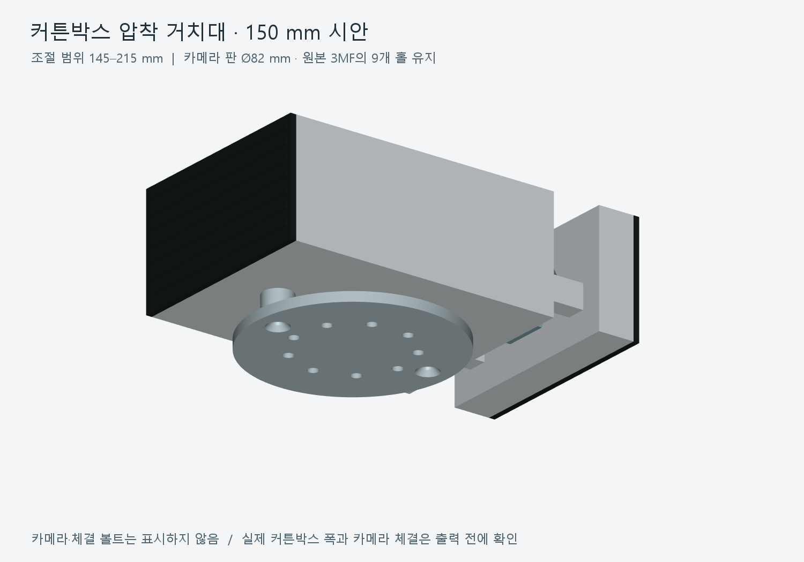
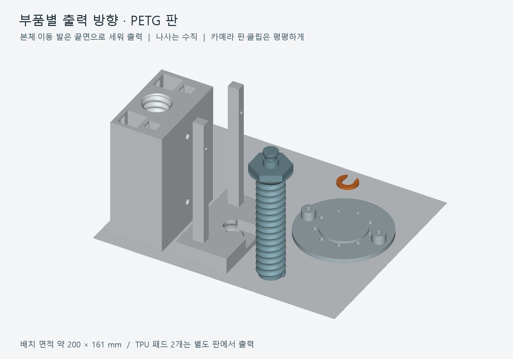
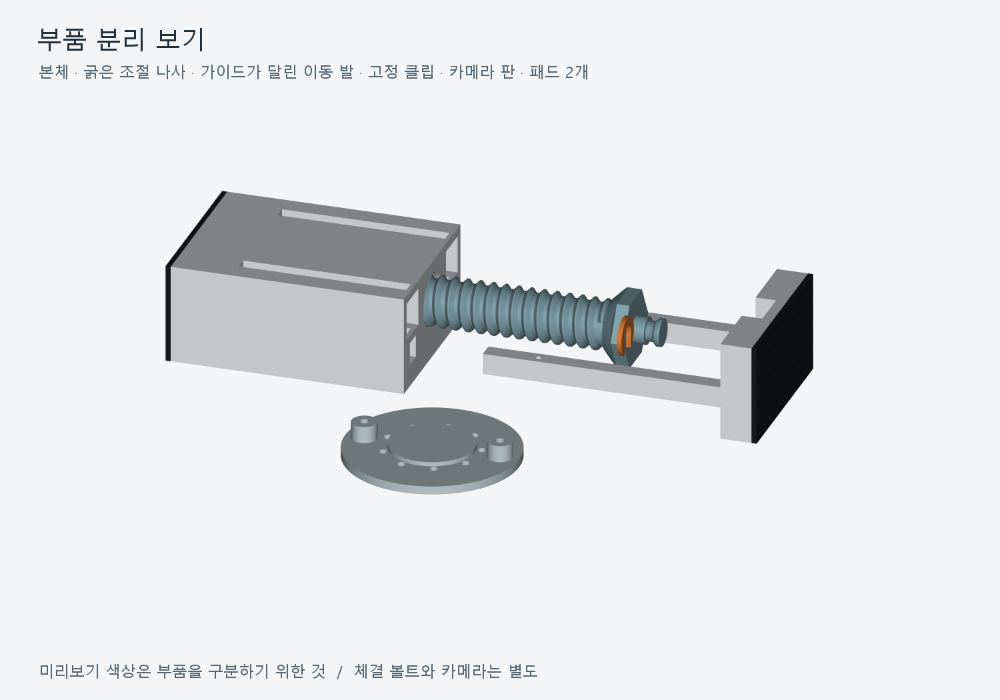

# Curtain Box Camera Mount

사진처럼 **커튼박스 양쪽 벽 사이에서 나사를 돌려 벌려 고정하는** 카메라 거치대입니다. 기준 설치 폭은 **150 mm**, 설계 사용 범위는 **145–215 mm**입니다. 본체·조절 나사·이동 발·고정 클립·카메라 판을 분리하고, 압착 패드 2개는 별도 재료로 출력합니다.

카메라 판은 사용자가 제공한 참고 3MF의 **외경 82 mm, 판 두께 4 mm, Ø4.3 mm 구멍 9개**를 유지했습니다. 구멍 배치 원은 Ø45.03333 mm, 각도는 10°부터 40° 간격입니다. **Tapo C250의 직접 체결과 실제 출력·설치 하중은 아직 확인하지 않았습니다.**

## 다운로드

**[전체 STL·STEP·3MF ZIP](CurtainBox_CameraMount_145-215mm_STL_STEP_3MF.zip)** — 아래 부품, 나사 시험 부품, 조립 안내, 미리보기, FreeCAD 원본과 검증 자료 포함.

| 부품 | 수량·재료 | STL | STEP |
| --- | --- | --- | --- |
| 본체 | 1 · PETG | [Body.stl](STL/01_body.stl) | [Body.step](STEP/01_body.step) |
| 조절 나사 | 1 · PETG | [Screw.stl](STL/02_screw.stl) | [Screw.step](STEP/02_screw.step) |
| 가이드가 달린 이동 발 | 1 · PETG | [Moving_Foot.stl](STL/03_moving_foot.stl) | [Moving_Foot.step](STEP/03_moving_foot.step) |
| 나사 끝 고정 클립 | 1 · PETG | [Retaining_Clip.stl](STL/04_retaining_clip.stl) | [Retaining_Clip.step](STEP/04_retaining_clip.step) |
| 카메라 고정판 | 1 · PETG | [Camera_Plate.stl](STL/05_camera_plate.stl) | [Camera_Plate.step](STEP/05_camera_plate.step) |
| 압착 패드 | **2 · TPU 95A** | [TPU_Pad.stl](STL/06_TPU_pad.stl) | [TPU_Pad.step](STEP/06_TPU_pad.step) |

개별 STL·STEP는 모두 출력 방향과 바닥 높이를 맞췄습니다. 자동 회전으로 방향을 바꾸지 마세요.

| 출력 배치 | 3MF |
| --- | --- |
| PETG 부품 5개 | [Print_PETG.3mf](3MF/CurtainBox_Mount_Print_PETG.3mf) |
| TPU 패드 2개 | [Print_TPU.3mf](3MF/CurtainBox_Mount_Print_TPU.3mf) |
| 작은 나사·너트 시험 부품 | [Thread_Fit_Test.3mf](Optional_Tests/Thread_Fit_Test.3mf) |

3MF는 **특정 프린터·필라멘트·서포트 설정을 포함하지 않는 형상 파일**입니다. 자신의 프린터 프로필을 선택하고 **서포트 OFF**를 적용하세요. PETG 배치는 약 **200 × 161 mm**를 차지합니다. 베드가 작으면 개별 STL을 여러 판에 나누면 됩니다.

## 출력과 시험

**0.4 mm 노즐, 0.2 mm 레이어, 벽 5줄**을 시작값으로 잡았습니다. 본체·이동 발은 25–30% 채움, 나사와 클립은 80–100% 채움, 카메라 판은 위·아래 6겹 이상입니다. 길게 세워 출력하는 나사와 가이드는 필요하면 5–8 mm 브림을 추가하세요.

| 부품 | 배치된 출력 방향 |
| --- | --- |
| 본체 | 고정 발 끝면이 바닥, 길이 방향이 수직 |
| 조절 나사 | 축 수직, 나사 끝부터 손잡이 방향으로 출력 |
| 이동 발 | 압착면이 바닥, 두 가이드가 수직 |
| 클립 | 평평하게 |
| 카메라 판 | 평평한 판이 바닥, 지지 보스가 위 |
| TPU 패드 | 평평한 면이 바닥, 돌기가 위 |

서포트 없이 출력할 수 있도록 큰 천장 면과 수평 나사 구멍을 피하고, 나사산에 45° 경사를 사용했습니다. 작은 구멍·스톱 슬롯에는 **약 3–6.4 mm의 짧은 브리지**가 있습니다. **실제 슬라이싱이나 출력으로 서포트 없는 결과를 확인한 것은 아닙니다.**

본품보다 먼저 [시험 너트 STL](Optional_Tests/fit_nut.stl)과 [시험 나사 STL](Optional_Tests/fit_screw.stl)을 출력해 손으로 돌려 끼워지는지 확인하세요. [너트 STEP](Optional_Tests/fit_nut.step)과 [나사 STEP](Optional_Tests/fit_screw.step)도 제공합니다. 새 나사산은 외경 24 mm·피치 6 mm의 출력용 형상이며, 참고 모델의 나사와 호환되지 않습니다.

## 체결과 크기

- 본체: **110 × 82 × 47 mm**. 패드: **82 × 47 × 3 mm**.
- 슬라이드 틈새: 한쪽당 **0.35 mm**. 나사 반경 틈새: **0.35 mm**.
- 최대 폭 215 mm에서 가이드 겹침은 약 **30.7 mm**, 나사 맞물림은 약 **22.3 mm**입니다.
- 나사 끝이 이동 발의 막힌 받침면을 밀어 압착력을 전달합니다. 작은 C형 클립은 분리 방지용입니다.
- 카메라 판은 본체 아래에 M4 접시머리 볼트 2개로 체결합니다. M4 인서트 2개, M3 정지 나사 2개와 패드용 접착재도 필요합니다.

**30평·자이·준공 시기만으로 커튼박스 내경을 확정할 수 없습니다.** 위 범위는 이 시안의 설계값이며 아파트의 공통 규격을 뜻하지 않습니다. 실제 벽 사이 거리와 카메라 고정판 체결 위치를 출력 전에 확인하세요.

준비물 규격과 조립 순서는 [한국어 출력·조립 안내](Assembly_Guide_KO.md)에 있습니다. **[조립 참고 STEP](Reference/CurtainBox_Mount_Assembly_REFERENCE.step)**과 **[조립 참고 3MF](Reference/CurtainBox_Mount_Assembly_REFERENCE.3mf)**는 확인용이며, 조립 상태를 그대로 출력하는 파일이 아닙니다.

## 검증 범위와 원본

- [FreeCAD 원본](Native_CAD/CurtainBox_CameraMount.FCStd), [설계 치수](Verification/Dimensions.json)
- [CAD 검증](Verification/CAD_Validation.json), [STEP 재가져오기 검증](Verification/STEP_Validation.json)
- [STL·3MF 파일 검증](Verification/STL_3MF_Validation.json), [독립 나사 맞물림 검사](Verification/Thread_Mesh_Validation.json)

단일 CAD 솔리드, 닫힌 STL과 면 방향, STEP 재가져오기, 출력 바닥 접촉과 부품 배치를 확인합니다. 나사 맞물림은 145 / 150 / 175 / 215 mm에서 독립 메시 검사를 수행했습니다. **실물 출력, C250 직접 체결, 벽면 고정력과 반복 사용 내구성은 아직 시험하지 않았습니다.**

`tools/build_mount.py`는 FreeCAD와 NumPy로 부품·STEP·CAD 원본을 생성합니다. 검증한 환경은 **FreeCAD 1.0.2의 Python 3.11**입니다. `tools/package_3mf.py`는 Python 표준 라이브러리로 배치된 3MF를 만듭니다. 미리보기와 독립 메시 검사는 VTK 9.3 및 Pillow를 사용하며, 미리보기의 한국어 글꼴은 Windows의 맑은 고딕입니다. 자세한 실행 순서는 [tools 안내](tools/README.md)를 참고하세요. `Dimensions.json`은 치수 기록이며 변경해도 CAD가 자동 갱신되지는 않습니다.

## 참고 모델

카메라 판의 기능 치수는 사용자가 제공한 Blueming의 **[摄像头窗帘盒支架](https://makerworld.com/ko/models/2891034-camera-curtain-box-mount)** 3MF를 참고했습니다. 해당 원본에 표시된 라이선스는 **Standard Digital File License**입니다. 이 폴더에는 원본 3MF·STEP를 재배포하지 않으며, 새로 생성한 압착형 본체·가이드·나사와 참고한 판 치수만 포함합니다. 원본 모델의 라이선스를 변경하거나 이 저장소 전체에 다른 라이선스를 부여한 것은 아닙니다.
