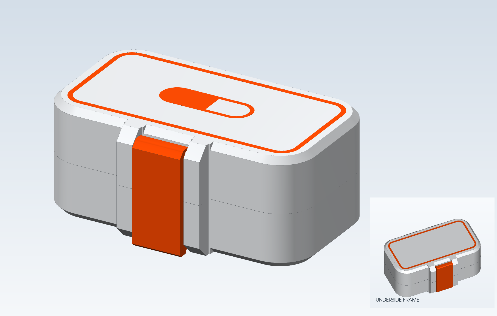
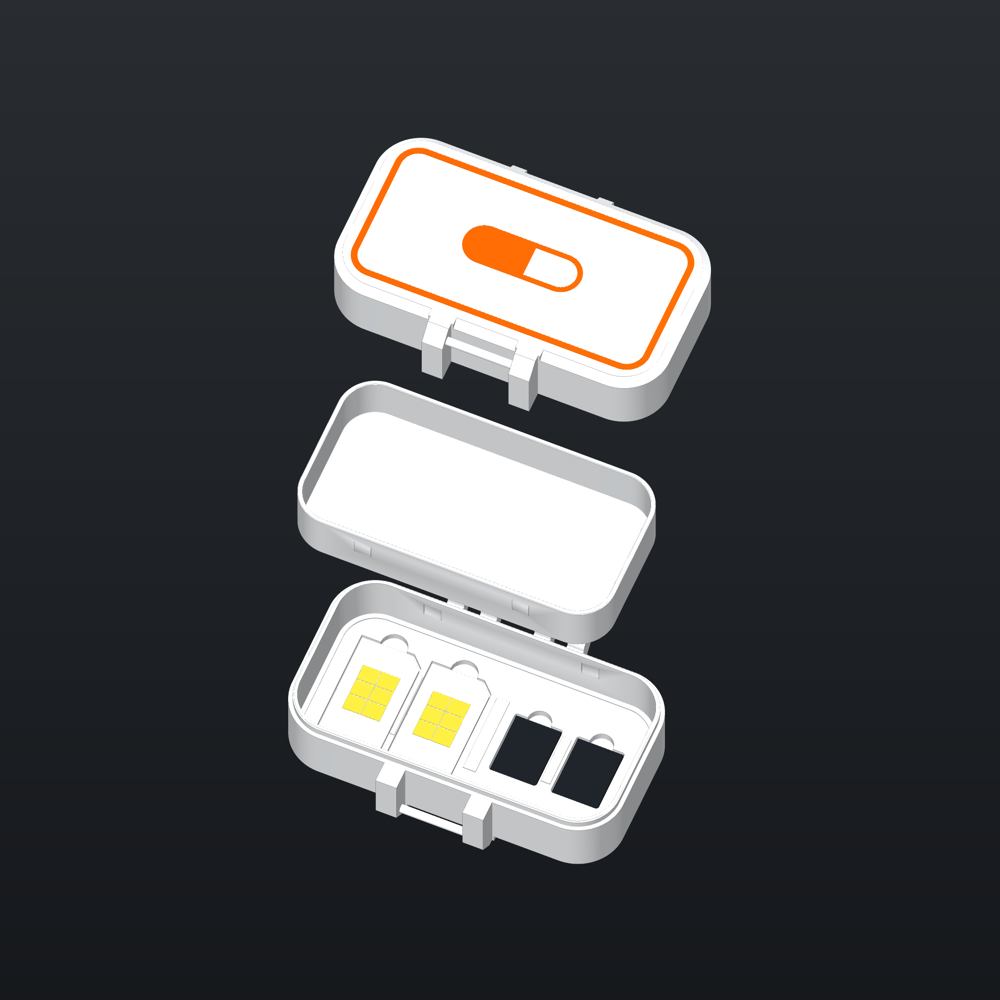

# ShieldSigner Secret Case — Pill Logo

흰색 케이스에 **주황색 상·하판 테두리와 윗면 알약 마크**를 넣었습니다. ShieldSigner 글자는 제거하고, 알약 왼쪽은 채우고 오른쪽 내부는 비워두었습니다. 앞 레버도 주황색입니다.



## 다운로드

| 부품 | STL | STEP |
| --- | --- | --- |
| 케이스 — 본체·뚜껑·레버가 열린 출력 배치 | [Case_Open.stl](STL/Case_Open.stl) | [Case_Open.step](STEP/Case_Open.step) |
| 아랫판 비밀 트레이 — 기존 밀착형 V2 | [Lower_Tray.stl](STL/Lower_Tray.stl) | [Lower_Tray.step](STEP/Lower_Tray.step) |

다색 출력에는 **[Case_Open_Color.3mf](3MF/Case_Open_Color.3mf)**를 사용하세요. 같은 위치의 네 색상 파트를 한 조립체 안에 묶었습니다. STL도 네 개의 이름 있는 파트로 저장했으며, STEP에는 분리된 솔리드와 색상을 포함했습니다.

| 파트 | 색상 | 필라멘트 |
| --- | --- | --- |
| `Base_White` | 흰색 | 1 |
| `Lid_White` | 흰색 | 1 |
| `Pill_And_Borders_Orange` | 주황색 | 2 |
| `Clip_Orange` | 주황색 | 2 |

## 출력과 크기

- **0.4 mm 노즐**, **첫 층 높이 0.20 mm** 기준입니다. 주황색 마크는 바깥면과 평평한 첫 0.20 mm 층에 들어갑니다.
- 테두리 선폭 **1.48 mm**, 알약 선폭 **1.23 mm**입니다. 테두리 외곽은 약 72 × 35.21 mm, 알약은 약 28.40 × 9.88 mm입니다.
- 케이스 파일은 열린 상태의 출력 배치입니다. 스크류리스 경첩·앞 레버와 색상 파트의 상대 위치를 유지하고, 부품별 자동 배치로 옮기지 마세요.
- 3MF에서 흰색·주황색 필라멘트를 지정하고 사용할 프린터·재료 프로필을 선택하세요. STL 자체에는 필라멘트 색상 정보가 없으므로 다색 파트 구분에는 3MF가 편합니다.
- 상·하판 바깥 모서리의 45° 면취는 **1.5 → 1.9 mm**로 0.4 mm 더 넓혔습니다. 뒤 경첩 지지부도 같은 경사에 이어집니다.
- 닫힌 높이는 **33.4 mm**입니다. 기기 기준 크기는 **72.6 × 35.7 × 24.3 mm**, 아랫판 트레이 안쪽은 **73.9 × 37.0 mm**입니다.
- 아랫판 트레이는 기존 파일 그대로이며, 케이스에는 트레이의 걸림 돌기가 안착하는 홈 4개를 유지했습니다. 윗판 트레이는 포함하지 않습니다.

## Secret 수납공간

일반 SIM **25 × 15 mm 2개**와 microSD **15 × 11 mm 2개**를 아랫판 트레이 아래에 보관할 수 있습니다.



그림은 실제 CAD 형상의 분해도입니다. SIM·microSD 카드는 수납 위치를 보여주는 참조 모형이며 출력 파일에는 들어 있지 않습니다.

## 폴더 구조

```text
Pill Logo/
├── STL/
│   ├── Case_Open.stl
│   └── Lower_Tray.stl
├── STEP/
│   ├── Case_Open.step
│   └── Lower_Tray.step
├── 3MF/
│   └── Case_Open_Color.3mf
├── images/
│   ├── closed-preview.png
│   └── secret-storage-preview.png
├── Native_CAD/
│   └── ShieldSigner_Pill_Logo.FCStd
└── Verification/
    ├── geometry_validation.json
    └── file_validation.json
```

[FreeCAD 원본](Native_CAD/ShieldSigner_Pill_Logo.FCStd), [형상 검증](Verification/geometry_validation.json), [STL·STEP·3MF 파일 검증](Verification/file_validation.json)을 함께 제공합니다. 파일을 다시 읽어 솔리드 유효성, 닫힌 STL 메쉬와 다색 파트 정렬을 확인했습니다. 로고와 모서리를 바꾼 이번 버전의 실물 출력 시험은 아직 하지 않았습니다.
