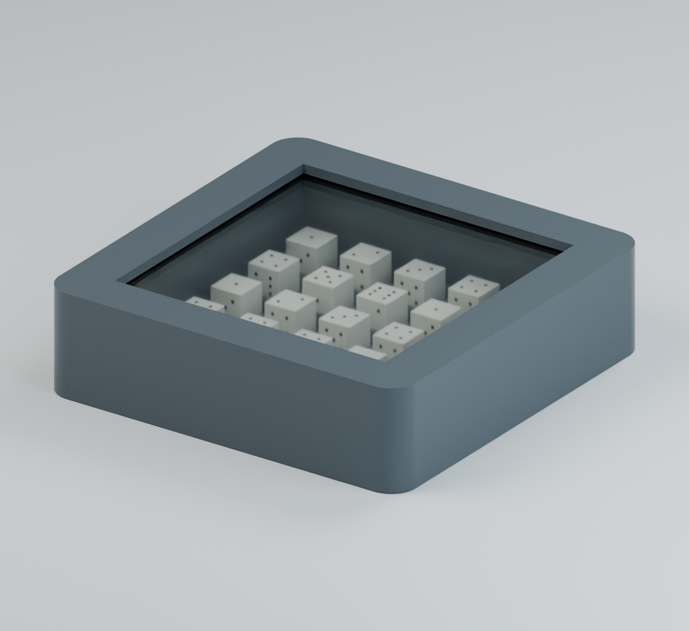
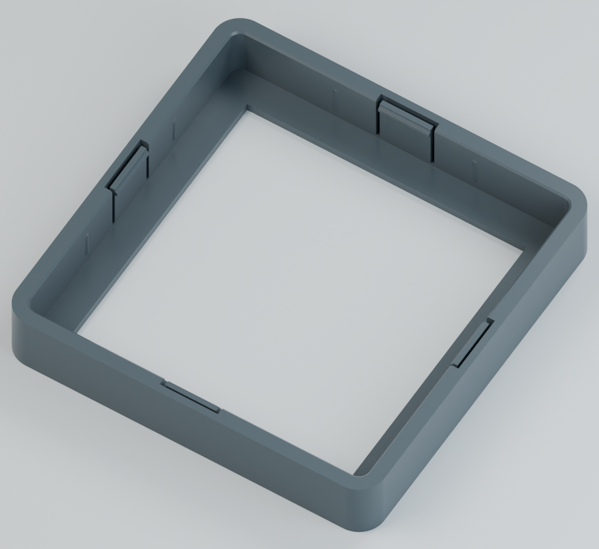

# DiceBox Hidden Lock

**최신 모델: [Strong Lock V2](V2/).** V1은 상·하판을 잡고 적은 힘으로 당겨도 분리된다는 실물 피드백을 받았습니다. V2는 숨겨진 걸쇠를 4개에서 8개로 늘리고 물림 깊이와 팔 두께를 보강했습니다. 아래 자료는 비교용 V1입니다.

한 변 **5 mm인 주사위 25개**를 흔들어 5×5 자리로 모으는 정사각형 DiceBox입니다. 완성 크기는 **58×58×15.6 mm**, 투명판 규격은 **50×50×2 mm**입니다. 본체와 뚜껑을 별도로 출력하고 투명판을 넣은 뒤 덮으므로 프린팅 도중 일시정지가 필요하지 않습니다.

## 내부 잠금 구조

뚜껑 안쪽의 탄성 걸쇠 4개가 본체의 수평 잠금 턱에 맞물립니다. 걸쇠 뒤에는 연속된 바깥벽이 있어 겉에서 걸쇠와 절개가 보이지 않습니다. 바깥쪽 해제 버튼이 없으므로 조립 후에는 분리가 어렵습니다.

이전 Slim 모델보다 뚜껑과 본체의 한쪽 설계 간극을 **0.25 → 0.10 mm**, 잠금 턱의 위아래 여유를 **0.35 → 0.05 mm**로 줄였습니다. 안쪽 압착 돌기 8개에는 **0.02 mm의 명목 압입량**을 적용해 좌우 흔들림을 줄이도록 설계했습니다. 이는 CAD 기준값이며 실제 인쇄물의 유격을 측정한 값은 아닙니다.

## 다운로드

**[전체 STL·STEP ZIP](DiceBox_50x50x2_HiddenLock_PLA_STL_STEP.zip)**에는 아래 부품, 체결 시험 부품, 미리보기, 조립 안내, FreeCAD 원본과 검증 보고서가 들어 있습니다.

| 부품 | STL | STEP |
| --- | --- | --- |
| 본체 | [Base.stl](DiceBox_HiddenLock_Base.stl) | [Base.step](DiceBox_HiddenLock_Base.step) |
| 뚜껑 | [Lid.stl](DiceBox_HiddenLock_Lid.stl) | [Lid.step](DiceBox_HiddenLock_Lid.step) |
| 본체·뚜껑 출력 배치 | [Print_Layout.stl](DiceBox_HiddenLock_Print_Layout.stl) | [Print_Layout.step](DiceBox_HiddenLock_Print_Layout.step) |

**본체와 뚜껑을 모두 새 파일로 출력해야 합니다.** 이전 Slim 부품과는 호환되지 않습니다. 개별 본체·뚜껑 파일 또는 출력 배치 파일 중 하나를 선택하십시오. STL과 STEP은 같은 위치와 방향으로 검증했으며, 뚜껑은 윗면이 출력 바닥에 닿도록 뒤집어 두었습니다.

## 출력과 조립

PLA 예시 조건은 0.4 mm 노즐, 0.2 mm 고정 레이어, Arachne 벽 생성, 벽 4줄, Gyroid 채움 20%, 위·아래 각각 7층입니다. Bambu Lab A1 예시에서 서포트와 브림 없이 슬라이싱했습니다. 실제 프린터에 맞는 프로필과 온도를 사용하십시오.

걸쇠 틈의 출력 잔여물을 제거하고 주사위 25개와 투명판을 넣습니다. 뚜껑을 수평으로 맞춘 뒤 네 면이 고르게 내려가도록 눌러 네 걸쇠를 체결합니다. 조립 후 분리가 어려우므로 내용물과 투명판의 안착을 먼저 확인하십시오.

상세 치수와 작업 순서는 [한국어 조립 안내](Assembly_Guide_KO.txt)에 있습니다.

## 체결 시험 부품

| 시험 | STL | STEP |
| --- | --- | --- |
| 작은 본체 접합부 | [Joint_Base_Test.stl](Optional_Tests/OPTIONAL_HiddenLock_Joint_Base_Test.stl) | [Joint_Base_Test.step](Optional_Tests/OPTIONAL_HiddenLock_Joint_Base_Test.step) |
| 작은 뚜껑 접합부 | [Joint_Lid_Test.stl](Optional_Tests/OPTIONAL_HiddenLock_Joint_Lid_Test.stl) | [Joint_Lid_Test.step](Optional_Tests/OPTIONAL_HiddenLock_Joint_Lid_Test.step) |
| 본체 테두리 | [Base_Rim_Test.stl](Optional_Tests/OPTIONAL_HiddenLock_Base_Rim_Test.stl) | [Base_Rim_Test.step](Optional_Tests/OPTIONAL_HiddenLock_Base_Rim_Test.step) |

작은 접합부 두 개는 한쪽 걸쇠의 체결을 적은 재료로 확인하는 용도입니다. 전체 프레임의 맞춤과 압착 돌기 접촉은 본체 테두리 시험 부품과 최종 뚜껑으로 확인할 수 있습니다.

## 원본과 검증

- [FreeCAD 원본](Native_CAD/DiceBox_HiddenLock_50x50x2.FCStd)
- [조립 상태 STEP](Reference/DiceBox_HiddenLock_Assembly_REFERENCE.step)
- [설계 치수](Verification/Dimensions.json), [CAD 검증](Verification/Validation.json), [독립 STL 검증](Verification/Independent_STL_Validation.json)
- [이전 Slim 모델과의 체결 치수 비교](Verification/Fit_Comparison.json), [PLA 예시 슬라이싱 검증](Verification/Slicing_Validation.json)

`Reference`의 투명판·주사위·닫힌 뚜껑은 조립 확인용입니다. 실제 투명판을 별도로 준비하십시오. 조립 STEP은 탄성 변형 전의 형상이므로 압착 돌기 끝에 의도된 작은 간섭이 있습니다. `Baseline_Slim`은 이전 모델과의 비교 검증용 STEP이고, `tools`는 FreeCAD Python 환경에서 형상을 재생성하고 STL을 검증하는 코드입니다.

CAD 솔리드와 닫힌 STL, STEP 재가져오기 및 출력 방향, 투명판 삽입, 주사위 자리와 회전 공간을 검증했습니다. 예시 슬라이싱은 경고 없이 서포트 없는 출력 경로를 생성했습니다. **실물 출력의 체결력, 균열 여부, 완전한 무유격은 아직 확인하지 않았으며 출력 공차에 따라 달라집니다.**
