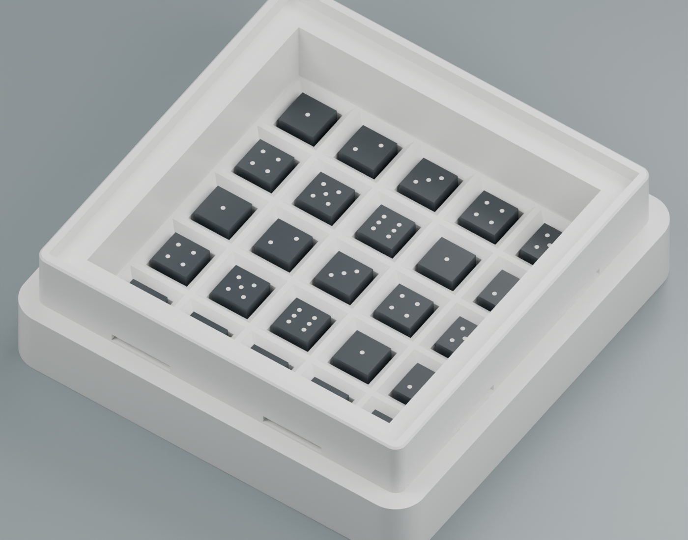
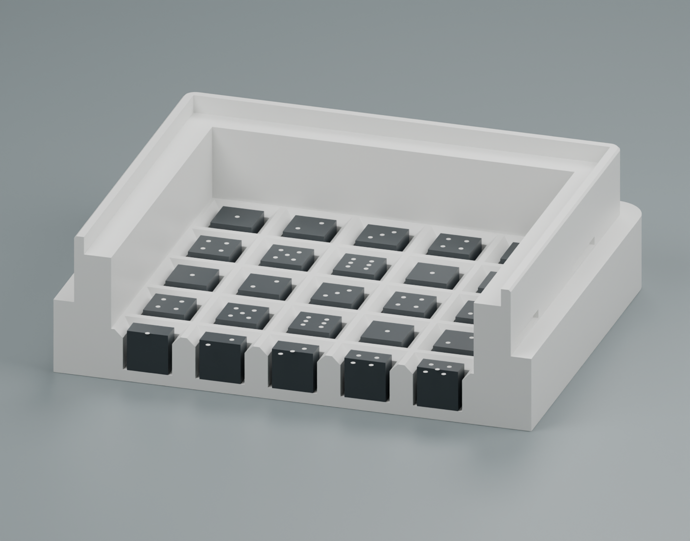

# Entropy Box — Deep Pockets V3

5 mm 주사위가 얕은 칸에 걸쳐 비스듬히 놓이는 실물 피드백에 따라, **25개 칸의 깊이를 1.6 → 5.0 mm**로 높인 Entropy Box입니다. 주사위가 바닥에 정상 안착하면 윗면과 칸막이 상단이 같은 높이입니다.

완성 크기는 **58×58×19.0 mm**이며, 한 변 **5 mm인 주사위 25개**, **50×50×2 mm 투명판**, 칸 위의 자유 회전 공간 **9.0 mm**를 사용합니다. 기존 **Strong Lock V2 뚜껑을 재사용**할 수 있으므로 본체만 다시 출력하면 됩니다. 이 폴더의 이전 출력 부품과 V2 하위 폴더를 현재 V3 자료로 교체했습니다.

## 수정 치수

| 항목 | 이전 V2 | 현재 V3 |
| --- | --- | --- |
| 유효 칸 깊이 | 1.6 mm | 5.0 mm |
| 아래쪽 수직 지지 구간 | 0.6 mm | 4.0 mm |
| 칸 입구 경사 높이 | 1.0 mm | 1.0 mm |
| 아래쪽 칸 폭 / 입구 폭 | 6.0 / 8.0 mm | 6.0 / 8.0 mm |
| 칸 간격 | 8.8 mm | 8.8 mm |
| 바닥 두께 | 1.4 mm | 1.4 mm |
| 칸 위의 자유 회전 공간 | 9.0 mm | 9.0 mm |
| 완성 높이 | 15.6 mm | 19.0 mm |

투명판과 상부 결합부 전체를 3.4 mm 높였습니다. 기존 잠금부의 물림, 팔 길이와 공차는 그대로 유지되며, 제공하는 뚜껑 STL·STEP은 V2 파일과 바이트까지 동일합니다. 숨겨진 걸쇠 8개와 압착 돌기 구조도 유지됩니다. V1 또는 다른 뚜껑과의 호환은 검증하지 않았습니다.

## 다운로드

**[전체 STL·STEP ZIP](Entropy_Box_V3_Deep_Pockets_STL_STEP.zip)** — 본체, 호환 뚜껑, 출력 배치, 9칸 시험판, FreeCAD 원본, 조립·비교 자료와 검증 결과를 포함합니다.

| 부품 | STL | STEP |
| --- | --- | --- |
| 깊은 칸 본체 | [본체 STL](Entropy_Box_V3_Deep_Base.stl) | [본체 STEP](Entropy_Box_V3_Deep_Base.step) |
| V2 호환 뚜껑 | [뚜껑 STL](Entropy_Box_V3_Compatible_Lid.stl) | [뚜껑 STEP](Entropy_Box_V3_Compatible_Lid.step) |
| 본체·뚜껑 출력 배치 | [배치 STL](Entropy_Box_V3_Print_Layout.stl) | [배치 STEP](Entropy_Box_V3_Print_Layout.step) |
| 28×28×6.4 mm, 9칸 시험판 | [시험판 STL](Optional_Test/OPTIONAL_V3_9_Pocket_Test_Tray.stl) | [시험판 STEP](Optional_Test/OPTIONAL_V3_9_Pocket_Test_Tray.step) |

개별 부품과 출력 배치 중 하나를 사용하십시오. 함께 불러오면 중복됩니다. 본체는 바닥이 출력판에 닿으며, 뚜껑은 윗면이 출력판에 닿는 방향입니다. `Reference`와 `Reference_V2`는 조립·단면·기존 형상 비교용이며 출력 대상이 아닙니다.

## 출력과 검증

PLA 시작 조건: 0.4 mm 노즐, 0.1 mm 고정 레이어, 벽 4줄, Gyroid 20%, 위·아래 두께 1.4 mm. 이번 수정 모델의 새 슬라이싱과 실제 출력은 수행하지 않았습니다. 먼저 9칸 시험판으로 실물 주사위의 안착과 깊이를 확인할 수 있습니다. 자세한 조립 방법은 [한국어 안내](Assembly_Guide_KO.txt)를 참고하십시오.

- [FreeCAD 원본](Native_CAD/Entropy_Box_V3_Deep_Pockets.FCStd), [조립 STEP](Reference/Entropy_Box_V3_Assembly_REFERENCE.step)
- [치수](Verification/Dimensions.json), [CAD 검사](Verification/Validation.json), [독립 STL 검사](Verification/Independent_STL_Validation.json)
- [칸 깊이 비교](Verification/Pocket_Depth_Comparison.json), [파일 SHA-256 목록](SHA256_Manifest.json)

유효 CAD 솔리드, 닫힌 STL과 면 방향·연결성, STEP 재가져오기와 위치, 25개 주사위의 바닥·윗면 높이, 안착 간섭과 회전 공간을 확인했습니다. 결합부는 기존 V2의 위치만 이동한 동일 형상이며, 기존 압착 돌기의 의도된 작은 간섭이 유지됩니다.

**실제 흔들기만으로 25개가 매번 한 칸씩 들어가는 성능과 출력 공차는 재출력 시험이 필요합니다.** 미리보기는 실제 CAD에서 렌더링했고, 주사위 눈금은 표시용입니다.

**기존 내부 두께 17 mm 종이 패키지는 현재 19 mm 제품과 맞지 않습니다.** 새 모델용으로 패키지 두께와 접기 보정을 수정한 뒤 주문해야 합니다.

`tools/verify_stl.py`는 이 폴더와 ZIP에서 바로 실행할 수 있습니다(Python·NumPy 필요). `tools/build_deep_pockets.py`는 FreeCAD Python으로 형상을 재생성하며, 결과를 작업 폴더 루트에 씁니다. 재생성 후 단면·렌더링 도구와 `tools/package_files.py`로 배포 ZIP을 다시 만들 수 있습니다. `Reference_V2`에는 원본 뚜껑과 비교용 입력이 들어 있습니다.
