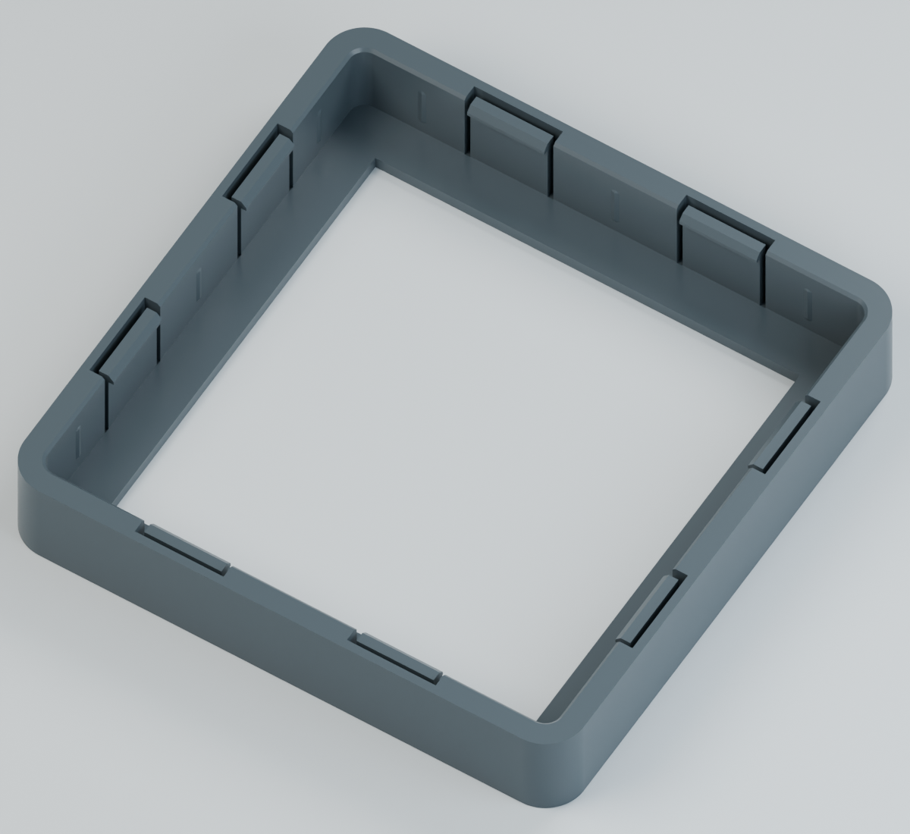
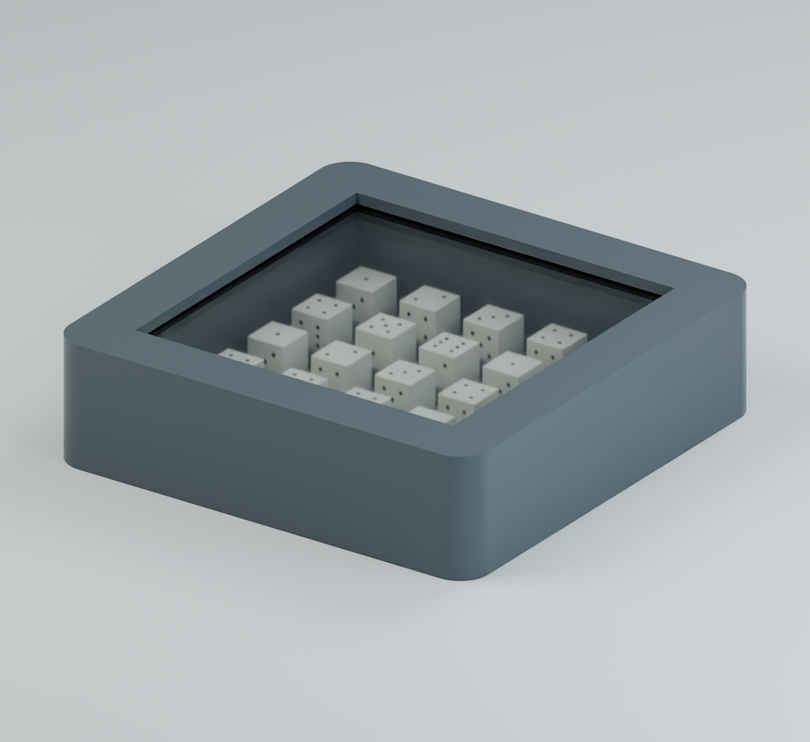

# DiceBox Strong Lock V2

이전 V1을 상판과 하판에서 잡고 조금만 당겨도 분리된다는 실물 피드백에 맞춰, **숨겨진 걸쇠 8개와 더 깊은 물림**으로 보강한 PLA용 DiceBox입니다. 실제 출력 치수와 인출력을 측정하지 않았으므로 물리적 원인을 확정하거나 인출력을 보증한 결과는 아닙니다.

완성 크기 **58×58×15.6 mm**, 한 변 **5 mm인 주사위 25개**, **50×50×2 mm 투명판**, 내부 회전 높이 9 mm를 유지했습니다. 본체와 뚜껑을 별도로 출력하고 투명판을 넣어 덮으므로 프린팅 도중 일시정지가 필요하지 않습니다.

## 체결 보강

| 항목 | V1 | V2 |
| --- | --- | --- |
| 숨겨진 걸쇠 | 4개 | 8개, 한 면에 2개씩 |
| 걸쇠 물림 깊이 | 0.30 mm | 0.50 mm |
| 탄성 팔 두께 | 0.8 mm | 1.0 mm |
| 자유 팔 길이 | 7.6 mm | 8.2 mm |
| 좌우 간극, 한쪽 기준 | 0.10 mm | 0.05 mm |
| 압착 돌기 | 8개 / 0.02 mm 명목 압입 | 12개 / 0.05 mm 명목 압입 |
| 총 수평 잠금면 면적 | 9.6 mm² | 32 mm² |

위 값은 CAD 명목값입니다. 잠금면 면적의 비율이 실제 인출력의 비율을 뜻하지는 않습니다. 위아래 잠금 여유는 0.05 mm를 유지했습니다. 탄성 팔 뒤에는 삽입 시 필요한 변위를 허용하는 공간을 확보하고 뿌리에 둥근 모서리를 적용했습니다. 겉면에는 걸쇠 구멍이나 해제 버튼이 없으며 조립 후에는 다시 열기 어렵습니다.

## 다운로드

**[전체 STL·STEP ZIP](DiceBox_50x50x2_StrongLockV2_PLA_STL_STEP.zip)** — 아래 부품, 시험 부품, 조립 안내, 미리보기, FreeCAD 원본과 검증 보고서 포함.

| 부품 | STL | STEP |
| --- | --- | --- |
| 본체 | [Base.stl](DiceBox_StrongLockV2_Base.stl) | [Base.step](DiceBox_StrongLockV2_Base.step) |
| 뚜껑 | [Lid.stl](DiceBox_StrongLockV2_Lid.stl) | [Lid.step](DiceBox_StrongLockV2_Lid.step) |
| 본체·뚜껑 출력 배치 | [Print_Layout.stl](DiceBox_StrongLockV2_Print_Layout.stl) | [Print_Layout.step](DiceBox_StrongLockV2_Print_Layout.step) |

**본체와 뚜껑 모두 V2로 출력해야 합니다. V1 부품과 호환되지 않습니다.** 개별 부품 또는 출력 배치 파일 중 하나를 선택하십시오. 뚜껑은 윗면이 출력 바닥에 닿고 안쪽이 위를 향하는 방향이며 STL과 STEP의 방향이 같습니다.

## 출력과 시험

PLA 예시 조건: **0.4 mm 노즐, 0.1 mm 고정 레이어, 첫 레이어 0.1 mm**, Arachne 벽 생성, 벽 4줄, Gyroid 채움 20%, 위·아래 14층. Bambu Lab A1 예시에서 서포트와 브림 없이 슬라이싱했습니다. 실제 기종에 맞는 프로필과 온도를 적용하십시오. 잠금 턱이 처지거나 결손 없이 출력되었는지, 걸쇠 옆과 뒤의 틈에 잔여물이 없는지 확인합니다.

| 시험 부품 | STL | STEP |
| --- | --- | --- |
| 작은 본체 접합부 | [Joint_Base_Test.stl](Optional_Tests/OPTIONAL_StrongLockV2_Joint_Base_Test.stl) | [Joint_Base_Test.step](Optional_Tests/OPTIONAL_StrongLockV2_Joint_Base_Test.step) |
| 작은 뚜껑 접합부 | [Joint_Lid_Test.stl](Optional_Tests/OPTIONAL_StrongLockV2_Joint_Lid_Test.stl) | [Joint_Lid_Test.step](Optional_Tests/OPTIONAL_StrongLockV2_Joint_Lid_Test.step) |
| 본체 테두리 | [Base_Rim_Test.stl](Optional_Tests/OPTIONAL_StrongLockV2_Base_Rim_Test.stl) | [Base_Rim_Test.step](Optional_Tests/OPTIONAL_StrongLockV2_Base_Rim_Test.step) |

작은 접합부 두 개는 한쪽 걸쇠의 삽입과 실제 잠금 턱 상태를 적은 재료로 확인하는 용도입니다. 전체 프레임, 8개 걸쇠와 압착 돌기 접촉은 본체 테두리 시험 부품과 최종 V2 뚜껑으로 확인할 수 있습니다.

주사위 25개와 투명판을 넣고 뚜껑을 수평으로 맞춰 네 면을 번갈아 고르게 눌러 체결합니다. 상세 순서와 확인 사항은 [한국어 조립 안내](Assembly_Guide_KO.txt)에 있습니다.

## 검증 범위

- [FreeCAD 원본](Native_CAD/DiceBox_StrongLockV2_50x50x2.FCStd), [조립 상태 STEP](Reference/DiceBox_StrongLockV2_Assembly_REFERENCE.step)
- [설계 치수](Verification/Dimensions.json), [CAD 검증](Verification/Validation.json), [독립 STL 검증](Verification/Independent_STL_Validation.json)
- [V1과의 비교](Verification/Fit_Comparison.json), [PLA 예시 슬라이싱](Verification/Slicing_Validation.json), [8개 잠금 턱의 첫 레이어 출력 경로](Verification/Hook_Toolpath_Validation.json)

CAD 솔리드, 닫힌 STL과 연결성, STEP 재가져오기 및 방향, 투명판 삽입, 주사위 자리와 회전 공간을 확인했습니다. 압착 돌기 끝에는 변형 전의 의도된 작은 간섭이 있습니다. 예시 슬라이싱은 경고 없이 서포트 없는 경로를 생성했고, 첫 잠금 턱 레이어에서도 8개 걸쇠 끝의 형상이 유지됩니다.

**실물 V2의 체결력, 균열 여부, 치수와 반복 사용 내구성은 아직 확인하지 않았습니다.** 단순 보 모델의 계산은 비교용이며 실제 PLA 파손 한계나 인출력을 예측하지 않습니다. 일반 스냅 체결 설계는 [Formlabs의 설계 안내](https://formlabs.com/blog/designing-3d-printed-snap-fit-enclosures/)를 참고했습니다.

`Reference`는 조립 확인용, `Baseline_HiddenLock`은 V1 비교 검증용이며 출력 부품이 아닙니다. `tools`에는 FreeCAD Python용 형상 재생성과 STL 검증 코드가 있습니다. [V1 자료로 돌아가기](../)
