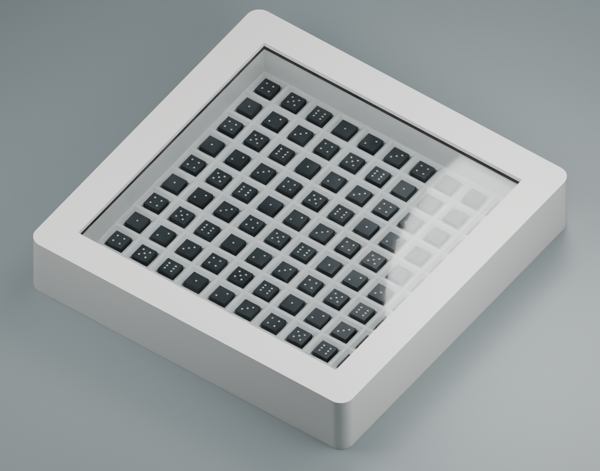
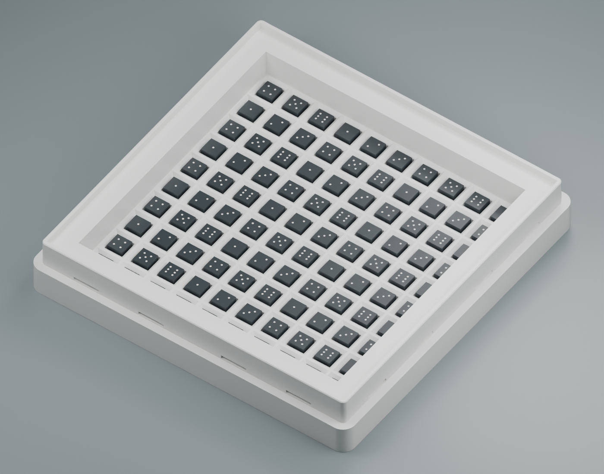
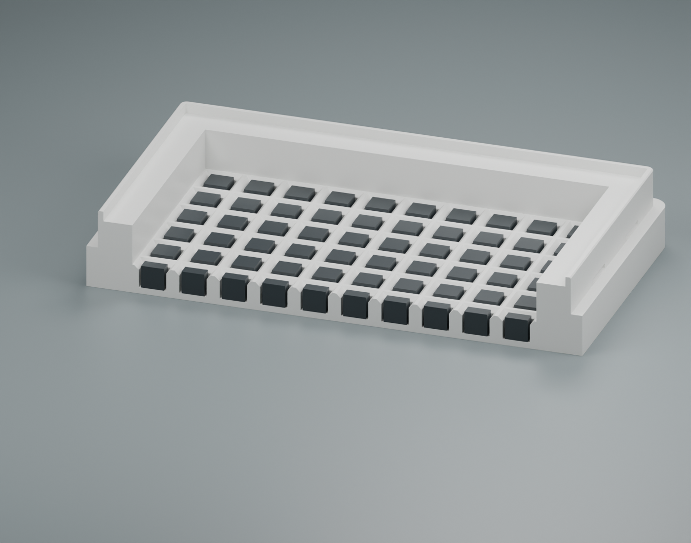

# Entropy Box — 100 Dice

**100×100×2mm 투명판**을 사용하는 100개용 Entropy Box입니다. 기존 25개용 V3의 수납칸 형상을 10×10 배열로 확장했습니다.

- 완성 외형: **108×108×19mm**
- 주사위: 한 변 **5mm**, **100개**
- 수납칸: 아래쪽 6×6mm, 입구 8×8mm, 간격 8.8mm, 깊이 5mm
- 칸 위 공용 굴림 공간: 높이 9mm, 평면 88×88mm
- 투명판 자리: 100.6×100.6mm, 한쪽 삽입 여유 0.3mm, 받침 폭 6mm
- 잠금: 외부에서 걸쇠 슬롯이 보이지 않는 내부 걸쇠 **16개**, 각 면 4개

## 다운로드

**[전체 STL·STEP ZIP](Entropy_Box_100_V3_100x100x2_STL_STEP.zip)** — 본체, 뚜껑, 선택 출력 배치, FreeCAD 원본, 조립 참고 형상, 미리보기와 검증 기록을 포함합니다.

| 부품 | STL | STEP |
|---|---|---|
| 본체 | [본체 STL](Entropy_Box_100_V3_Base.stl) | [본체 STEP](Entropy_Box_100_V3_Base.step) |
| 뚜껑 | [뚜껑 STL](Entropy_Box_100_V3_Lid.stl) | [뚜껑 STEP](Entropy_Box_100_V3_Lid.step) |
| 본체·뚜껑 선택 배치 | [배치 STL](Entropy_Box_100_V3_Print_Layout.stl) | [배치 STEP](Entropy_Box_100_V3_Print_Layout.step) |

## 출력과 조립

본체와 뚜껑은 제공한 STL 방향으로 출력하며, 각각 출력 바닥이 z=0입니다. 선택 배치의 크기는 **226×108mm**이므로, 220mm 출력판에서는 개별 부품을 따로 배치하십시오. 개별 파일과 선택 배치를 동시에 불러오면 부품이 중복됩니다.

주사위 100개를 넣고 별도로 준비한 **100×100×2mm 투명판**을 받침에 올린 뒤, 뚜껑을 수평으로 맞춰 네 면을 고르게 눌러 체결합니다. 이 100개용 본체와 뚜껑을 한 쌍으로 사용하십시오. 기존 25개용 부품과는 크기가 다릅니다.

PLA와 기존 V3 출력 설정을 기준으로 설계했습니다. 상세 내용은 [한국어 조립 안내](Assembly_Guide_KO.txt)를 참고하십시오. `Reference`는 주사위·투명판·조립·단면 확인용이며 실제 출력 부품이 아닙니다.

## 검증과 원본

- [FreeCAD 원본](Native_CAD/Entropy_Box_100_V3.FCStd)
- [닫힌 조립 STEP](Reference/Entropy_Box_100_V3_Assembly_REFERENCE.step)
- [치수](Verification/Dimensions.json), [CAD 검사](Verification/Validation.json)
- [100개 수납 독립 검사](Verification/Independent_Capacity_Validation.json), [독립 STL 검사](Verification/Independent_STL_Validation.json)
- [파일 SHA-256 목록](SHA256_Manifest.json)

100개 5mm 정육면체의 동일한 안착 높이와 바닥·측면 지지, 주사위 및 투명판 간섭, 판 삽입 경로, 회전 공간을 확인했습니다. 기존 V3와 비교한 수납칸 단면의 형상 차이는 0mm³입니다. 닫힌 STL의 면 방향·연결성, STEP 재가져오기와 위치, 조립 103개 솔리드와 출력 배치 2개 솔리드도 확인했습니다. 가이드 돌기의 작은 압착 간섭은 의도된 설계입니다.

**실제 슬라이싱·출력 시험은 수행하지 않았습니다.** 넓어진 PLA 부품의 수축과 휨, 100개 주사위가 흔들기만으로 모두 정렬되는 성능과 실제 체결력은 출력품으로 확인해야 합니다. 미리보기는 실제 모델에서 렌더링했으며 주사위 눈금은 표시용입니다.

[25개용 V3](../../DiceBox%20Hidden%20Lock/)도 별도 모델로 제공됩니다. 기존 59×59×17mm 종이 패키지는 이 100개용 제품과 크기가 맞지 않습니다.
