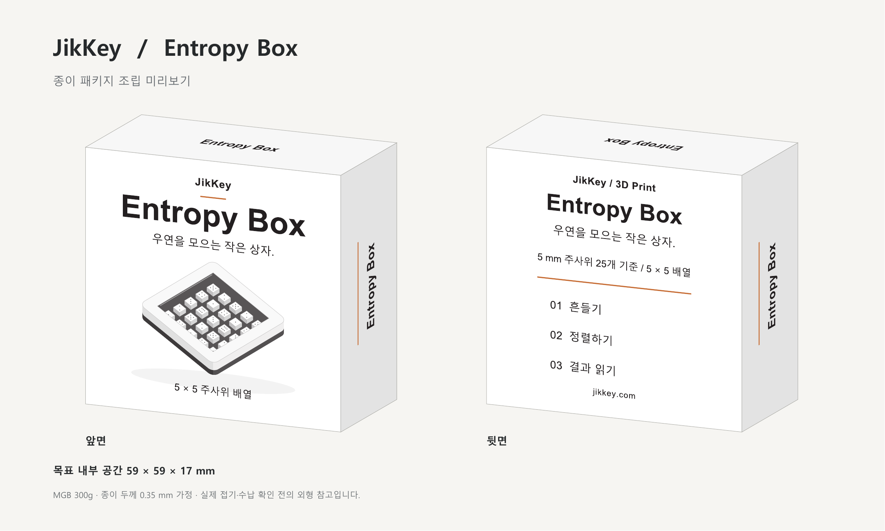

# Entropy Box paper package

**Compatibility:** this carton is for the earlier 15.6 mm model. The current [Deep Pockets V3](../../DiceBox%20Hidden%20Lock/) is 19.0 mm thick and does not fit this carton's 17 mm target interior. Revise the carton depth and folding allowance before ordering for V3.

Paper carton for the 58 × 58 × 15.6 mm Entropy Box, with artwork based on the [official product page](https://jikkey.com/ko/product/4). The target minimum usable interior is 59 × 59 × 17 mm.

| Deliverable | File |
| --- | --- |
| Layered master AI | [Entropy_Box_Paper_Package_59x59x17.ai](Entropy_Box_Paper_Package_59x59x17.ai) |
| Master PNG | [Entropy_Box_Paper_Package_59x59x17.png](Entropy_Box_Paper_Package_59x59x17.png) |
| Dimensions | [Entropy_Box_Paper_Package_Dimension_Guide.png](Entropy_Box_Paper_Package_Dimension_Guide.png) |
| 1:1 folding proof | [Entropy_Box_Paper_Package_1to1.pdf](Entropy_Box_Paper_Package_1to1.pdf) |
| Editable SVG backup | [Entropy_Box_Paper_Package_59x59x17.svg](Entropy_Box_Paper_Package_59x59x17.svg) |
| Manufacturer handoff | [제작처_전달문.txt](제작처_전달문.txt) |
| Vendor upload bundle, 50 cartons requested | [Entropy_Box_Wowpress_50_Order_Files.zip](Entropy_Box_Wowpress_50_Order_Files.zip) |

## Production files

Use `Vendor_Files/01_Entropy_Box_PRINT_ONLY.ai` for the printed artwork. All guide paths are removed from both its native AI data and embedded PDF. Use `Vendor_Files/02_Entropy_Box_DIELINE_REFERENCE_DO_NOT_PRINT.ai` separately for cutting and creasing; its colored lines must not be printed. The master AI and annotated proof are review files, not artwork-only intake files.

MGB 300g is specified, assuming a 0.35 mm caliper. Cut bounds are 164.80 × 111.45 mm; the single-carton artboard is 169.80 × 116.45 mm, including 2.5 mm on each side. Body score intervals are 59.70 × 60.05 mm with 17.70 mm side panels, a 10 mm glue tab and 8 mm tuck flaps.

The Wowpress nonstandard-size options describe maximum layout sizes, not this carton's physical size. Do not enlarge the artwork to those limits. The handoff requests **50 finished cut/creased carton blanks**, with actual stock thickness, imposition, custom cutting, creasing and gluing scope confirmed by the manufacturer before production. No order acceptance or payment is implied by this repository.

## Validation and limitations

The original master has 245 vector paths, a closed noncrossing cut outline, 12 crease paths, outlined lettering and no external images. Native Adobe editing data and embedded PDF coordinates were compared; see `Package_Validation.json`. The print-only file has 188 artwork paths; the separate die file has 13 cutting/creasing paths. Both preserve the master's dimensions and positions.

Adobe Illustrator is unavailable in the build environment, so direct Illustrator open/save was not tested. Actual MGB stock folding and product fit are untested. The folded preview maps the actual panel artwork to projected carton faces and is a geometry illustration, not a photograph or physical-fit verification.

`tools/build_package.py` regenerates the master and proof; `tools/verify_package.py` validates the master; `tools/build_handoff.py` creates vendor files and the folded preview. They require Python, ReportLab, pypdf, Windows fonts and Poppler. `Reference_Source/template_06.ai` is the supplied manufacturer's reference, not a file to print.
