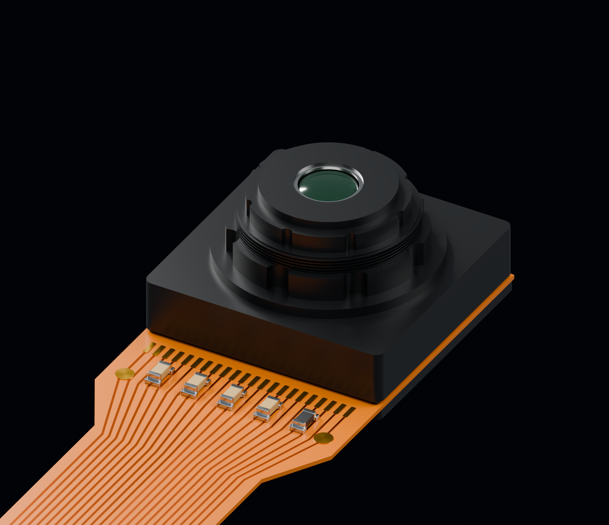
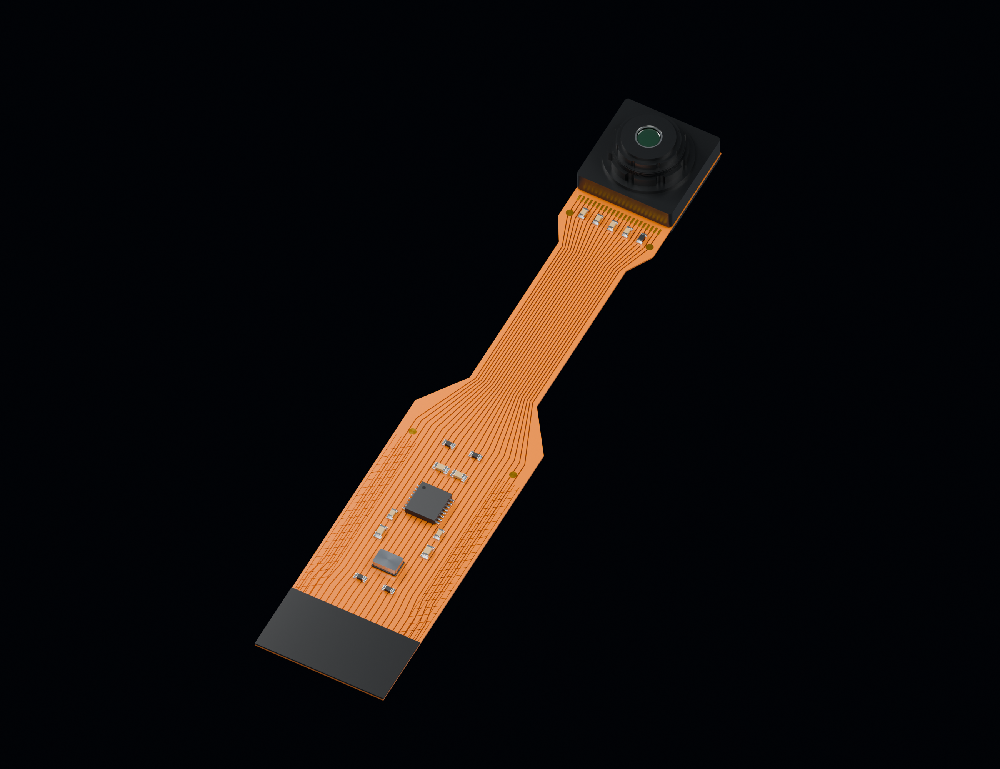

# OV5647 ZeroCam

참고 이미지의 제작자가 지목한 ZeroCam 형식의 OV5647 카메라입니다. 작은 카메라 헤드와 일체형 플렉스가 있으며 일반 25 × 24 mm 카메라 보드와 다른 형태입니다.

[STEP 다운로드](OV5647_ZeroCam.step) · [GLB 다운로드](OV5647_ZeroCam.glb)

## KeyShot에서 사용하기

- **STEP**: CAD 곡면·솔리드 형상과 기본 부품 색상을 가져올 때 사용합니다. 확대 렌더에서 곡면 품질을 조정하고 KeyShot 재질을 직접 지정하기 좋습니다.
- **GLB**: 메시 형상과 PBR 재질을 함께 가져올 때 사용합니다. 파일 하나로 이미지·재질 리소스를 전달할 수 있습니다.
- STEP 좌표 단위는 **mm**, GLB 좌표 단위는 **m**입니다. GLB의 1 m는 1000 mm에 해당하며 형상의 실제 크기는 두 형식이 같습니다.
- KeyShot Studio 2026은 STEP과 GLB를 지원합니다. glTF 재질에 OpenPBR가 추가된 **2025.3 이상**을 권장합니다. 이전 버전에서는 재질 표현이 달라질 수 있습니다.
- STEP의 이미지 텍스처는 포함되지 않습니다. 가져온 뒤 조명·금속·플라스틱·렌즈 재질을 확인하고 필요에 맞게 조정하십시오.
- 형상, STEP 재열기, GLB 구성과 내장 리소스를 검증했습니다. 실제 KeyShot 앱에서의 가져오기 시험은 수행하지 않았습니다.

[KeyShot 지원 형식](https://manuals.keyshot.com/kss2026/en-us/manual/supported-file-formats.html) · [glTF/OpenPBR 변경 사항](https://support.keyshot.com/en/knowledge-base/new-features-in-2025.3)

## 모델 범위

공칭 FPC 외곽 11.5 × 59.7 mm, 플렉스 두께 0.15 mm, 렌즈 하우징 8.5 × 8.5 mm, 재구성한 전체 높이 5.10 mm입니다. 카메라 광축 X=Y=0, 플렉스 후면 Z=0을 기준으로 저장했습니다. 22핀 접점은 렌즈 반대쪽 후면(−Z), 검정 단자 보강판은 전면(+Z)입니다.

GLB에는 금속·플라스틱·폴리이미드·렌즈 PBR 재질을 포함합니다. 카메라 배선 무늬와 접점은 형상으로 구성되어 외부 이미지가 필요 없습니다. 플렉스는 펼친 상태이며, 렌즈 내부·곡률·소형 부품과 회로 무늬는 사진 기반 시각 재구성입니다. 광학 설계나 제조용 회로 데이터가 아닙니다.

## 참고 자료

- https://x.com/designbtc/status/1511409194024505347
- https://thepihut.com/products/zerocam-camera-for-raspberry-pi-zero
- https://cdn.shopify.com/s/files/1/0176/3274/files/ZeroCam-dimensions_1.jpg?v=1676552138
