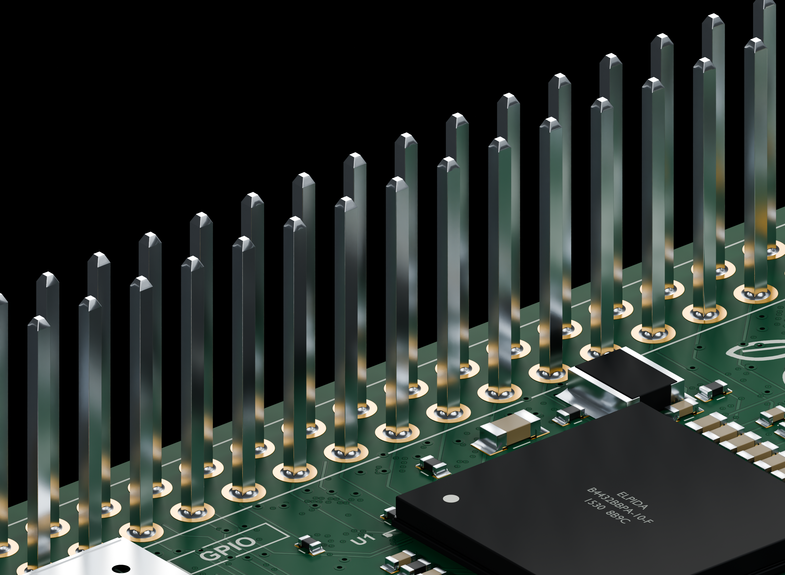
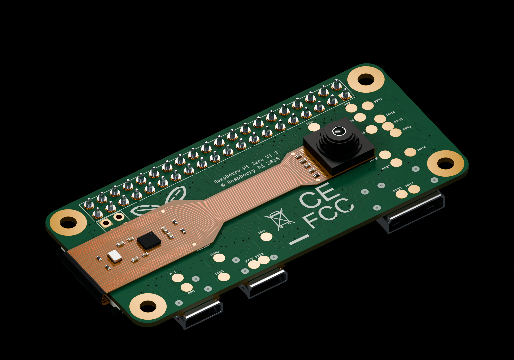
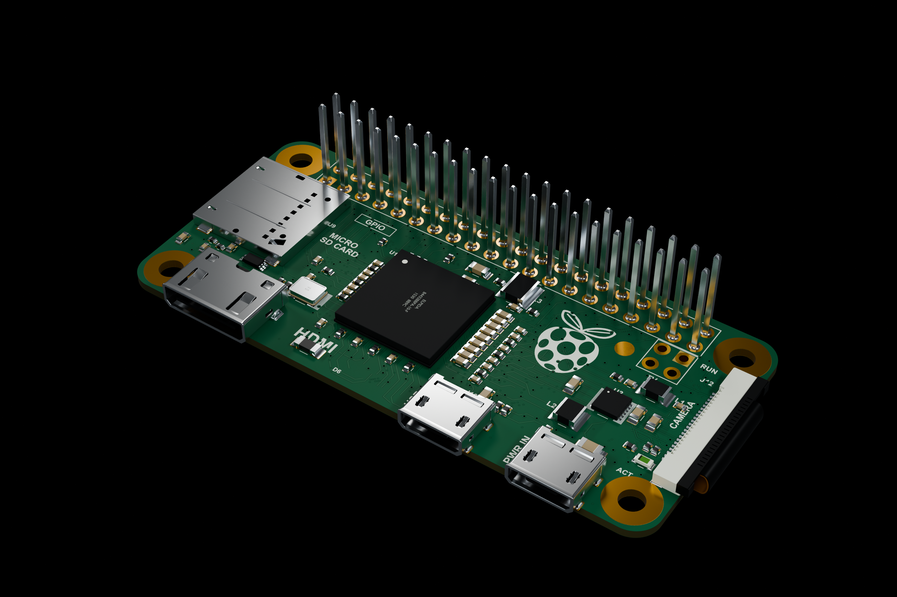
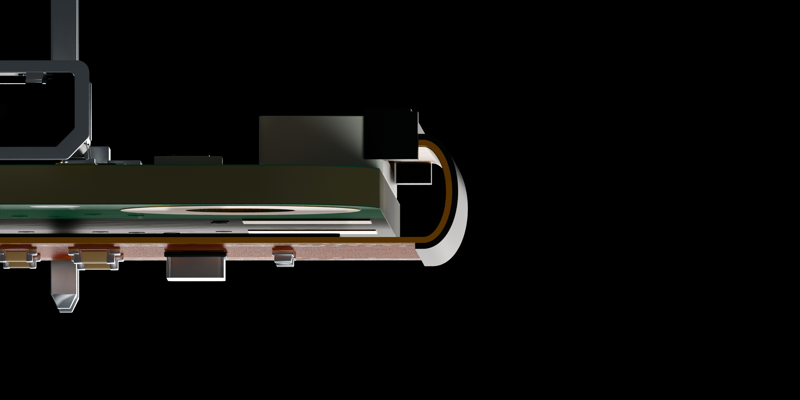
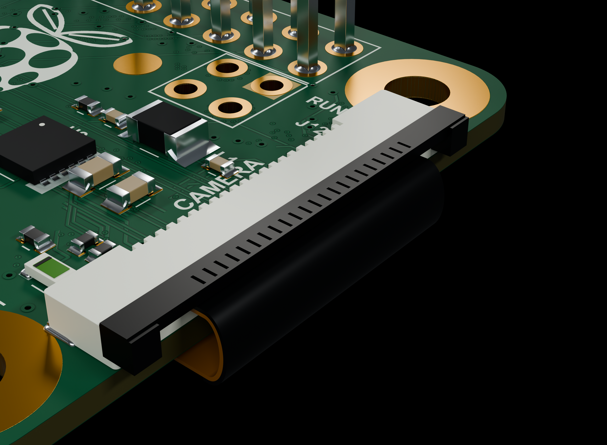

# Raspberry Pi Zero v1.3 + OV5647 — GPIO 11 mm 노출 핀

GPIO의 검정 플라스틱 지지대와 핀 1번 표시 돌기를 제거하고, 금속 40핀만 남긴 **Pi Zero v1.3 + 밑면 밀착 OV5647 ZeroCam 조립 모델**입니다. 핀 돌출 높이는 **전체 기판 윗면부터 핀 끝까지 11 mm**입니다. 납땜 부분·핀 아랫면 꼬리·단면·끝 테이퍼와 기존 포트·기판 디테일은 유지했습니다.

카메라를 반대쪽 기판 끝 방향으로 기존 모델보다 6.56 mm 더 당겼습니다. FPC 중립면 길이 59.7 mm를 유지하면서 가장자리 루프를 줄여 팽팽하게 당긴 배치를 표현했습니다. 케이블은 직선 수직 구간 없이 연속 곡선으로 돌아오고, 22개 접점의 CSI 내부 삽입 구간과 그 구간의 평평한 단자는 유지됩니다.

[STEP ZIP](Raspberry_Pi_Zero_v1_3_OV5647_Exposed_GPIO_11mm.step.zip) · [재질 포함 GLB ZIP](Raspberry_Pi_Zero_v1_3_OV5647_Exposed_GPIO_11mm.glb.zip) · [Blender 원본](Raspberry_Pi_Zero_v1_3_OV5647_Exposed_GPIO_11mm.blend)

전체 STEP이 GitHub의 [100 MiB 단일 파일 제한](https://docs.github.com/en/repositories/working-with-files/managing-large-files/about-large-files-on-github)을 넘어 ZIP으로 제공합니다. 압축을 풀면 개별 부품 이름과 솔리드를 보존한 `.step` 파일을 사용할 수 있습니다. GLB도 ZIP으로 제공하며, 압축을 풀고 안의 `.glb`를 가져오십시오. 파일 압축은 무손실이며 형상이나 텍스처를 줄이지 않았습니다.

## 사용과 기준

- **KeyShot·CAD:** STEP에는 1,871개 이름 있는 부품과 1,914개 솔리드가 있습니다. `Pi__`와 `Camera__`로 구분합니다. STEP은 정밀 형상 작업에 사용하고, 이미지 질감은 GLB로 가져오십시오. KeyShot의 [공식 지원 형식](https://manuals.keyshot.com/kss2026/en-us/manual/supported-file-formats.html)에는 STEP과 GLB/glTF가 포함되어 있습니다.
- **Blender:** 재질과 이미지 8개가 내장되어 있고, 전체·밑면·GPIO·굽힘·CSI의 5개 카메라와 조명 장면이 포함되어 있습니다.
- **단위:** STEP은 mm, GLB와 Blender 내부 좌표는 m입니다. CAD·Blender 기준으로 Pi 기판 중앙이 XY 원점, 전체 기판 밑면이 Z=0, 윗면이 Z=1 mm입니다. 따라서 핀 끝은 Z=12 mm이며, 아랫면 꼬리는 Z=−1.65 mm까지 내려옵니다. GLB는 표준 Y-up 축으로 내보냈습니다.

GPIO 지지대 두 부품과 40개 핀 길이만 바꾸고, 나머지 Pi CAD 1,539개와 렌더 메시 1,541개를 보존했습니다. 위·아래 납땜 80개도 포함됩니다. 두 버전의 카메라 292개 부품과 배치는 동일합니다. 카메라 뒷면과 Pi 밑면 사이의 부착층 두께는 명목 0.12 mm이고, 렌즈는 아래(−Z)를 향합니다.

## 모델 범위와 검증

이 모델은 렌더링을 위한 시각 재구성입니다. 원래 11.5 × 59.7 mm의 일체형 ZeroCam을 사용하며, 일반 25 × 24 mm 카메라 보드와 다릅니다. 이번 당긴 자세에서는 삽입부 바깥의 얇은 단자 보강층·접점·배선까지 굽힌 것으로 해석했습니다. 렌즈·칩 등 강체 부품은 변형하지 않고 옮겼습니다. 굽힘 반경과 보강층 유연성은 시각 조립 가정이며, 실제 장력이나 제조사 최소 굽힘 반경을 검증한 값은 아닙니다.

두 STEP을 다시 열어 40핀 위치·높이와 모든 솔리드를 검사하고, 원본 Pi 상세 형상의 보존을 비교했습니다. 별도 검사에서 케이블 곡면의 486개 지점, CSI 삽입부, 부품 간 간섭을 확인했습니다. 카메라와 Pi 사이의 의도하지 않은 겹침은 없으며, 기존 CSI 스프링과 FPC의 시각 접촉 겹침은 검증 기록에 따로 표시했습니다. 간섭 검사는 카메라 부품과 Pi 부품 사이를 대상으로 합니다.

Blender 원본과 GLB의 메시·크기·이미지를 독립 검사했습니다. 실제 KeyShot 앱에서 가져오기 시험은 수행하지 않았습니다. 상세 결과와 파일 해시는 [Verification.json](Verification.json)에 있습니다.

다른 핀 높이: [7 mm 버전](../Raspberry%20Pi%20Zero%20v1.3%20%2B%20OV5647%20GPIO%207mm/) · [기존 지지대 포함 조립 모델](../Raspberry%20Pi%20Zero%20v1.3%20%2B%20OV5647/) · [Geometrick 레퍼런스](../SeedSigner/Reference/)
