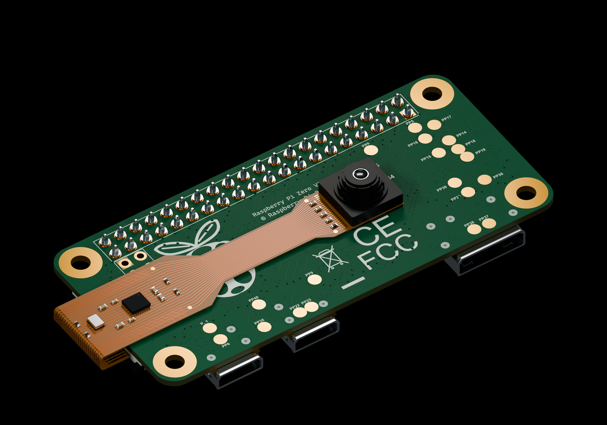
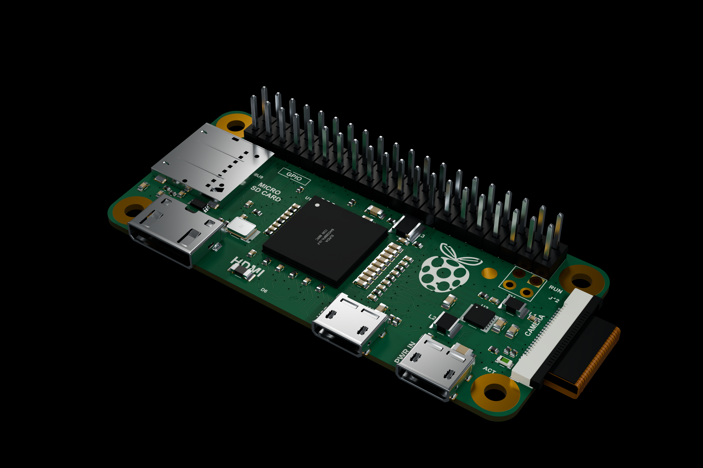
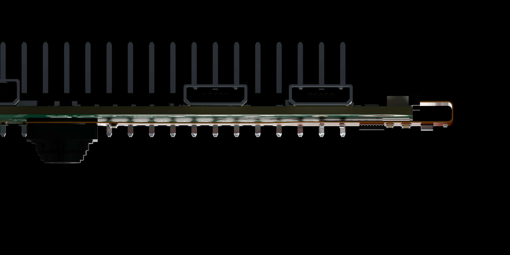
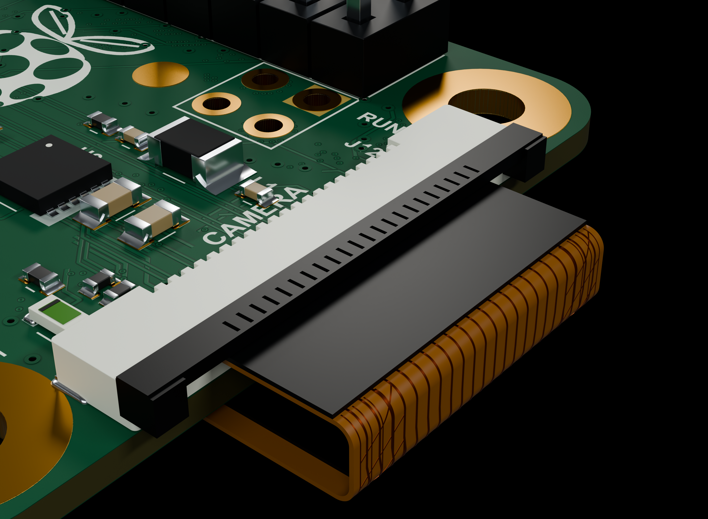

# Raspberry Pi Zero v1.3 + OV5647 — 밑면 밀착 조립 모델

상세 Pi Zero v1.3과 일체형 OV5647 ZeroCam을 실제 크기로 조립한 한 모델입니다. 카메라 헤드는 Pi 밑면에 붙고 렌즈는 아래(−Z)를 향합니다. 필름은 Pi 오른쪽 가장자리를 감싸 올라가 상면 CSI 소켓으로 들어갑니다. 40핀 GPIO 헤더가 포함되어 있습니다.

[STEP](Raspberry_Pi_Zero_v1_3_OV5647_Mounted.step) · [재질 포함 GLB](Raspberry_Pi_Zero_v1_3_OV5647_Mounted.glb) · [Blender 원본](Raspberry_Pi_Zero_v1_3_OV5647_Mounted.blend)

## 사용

- **KeyShot·CAD:** STEP에는 Pi와 카메라의 개별 솔리드 및 기본 색상이 들어 있습니다. `Pi__`와 `Camera__`로 부품을 구분할 수 있습니다.
- **KeyShot 재질:** GLB에는 기존 Pi의 기판 앞·뒷면 이미지, 금속 표면 맵과 카메라 재질이 내장되어 있습니다. [지원 형식](https://manuals.keyshot.com/kss2026/en-us/manual/supported-file-formats.html)을 확인하십시오.
- **Blender:** 이미지·재질과 전체, 밑면, 밀착부, CSI 연결부의 4개 카메라·조명 장면이 원본에 포함되어 있습니다.

STEP 단위는 mm, GLB와 Blender 내부 좌표는 m입니다. Pi 기판 중앙이 XY 원점, 기판 밑면이 Z=0입니다. 기존 Pi의 커넥터·납땜·GPIO 형상과 재질을 유지했습니다.

## 조립 범위

카메라 뒷면 보강층과 Pi 사이에 0.12 mm 부착층을 넣어 밀착 상태를 표현했습니다. 카메라 렌즈·소형 부품·단자 및 헤드 보강판은 강체로 유지하고, 필름과 얇은 검정 회로부 뒷면층을 굽혔습니다. 원래 11.5 × 59.7 mm의 일체형 ZeroCam을 사용하며 일반 25 × 24 mm 카메라 보드와는 다릅니다.

카메라 위치, 부착층, 필름 굽힘 반경 및 검정 후면층을 유연한 필름으로 해석한 부분은 시각 조립을 위한 가정입니다. 제조사의 최소 굽힘 반경·후면층 강성은 확인되지 않았으며 실제 제작 적합성이나 전기 연결을 검증한 모델은 아닙니다. 원작자의 조립 CAD를 복제한 모델이 아닙니다.

기존 CSI 스프링과 FPC 단자부의 금속 접점·표면층·코어 사이에는 미세한 형상 겹침이 남아 있으며 검증 기록에 별도로 표시했습니다. 이 부분은 접촉 상태를 나타내는 시각 표현입니다. 간섭 검사의 범위는 카메라 부품 각각과 Pi 부품 각각 사이의 교차 검사입니다.

STEP과 GLB·Blender를 독립적으로 다시 열어 형상과 크기를 검사했습니다. 원본 Pi 메시·UV·배치가 유지되는지, 렌즈가 아래를 향하는지, 22핀 CSI 단자 및 4개 장착홀을 확인했습니다. 실제 KeyShot 앱에서의 가져오기 시험은 수행하지 않았습니다. 상세 간섭·접촉 검사와 파일 해시는 [Verification.json](Verification.json)에 있습니다.

개별 모델: [Pi Zero](../Raspberry%20Pi%20Zero%20v1.3/) · [OV5647 ZeroCam](../OV5647%20ZeroCam/)

참고: [ZeroCam 제품과 치수](https://thepihut.com/products/zerocam-camera-for-raspberry-pi-zero) · [Raspberry Pi 카메라 연결 안내](https://github.com/raspberrypi/documentation/blob/master/documentation/asciidoc/accessories/camera/install.adoc) · [Geometrick 렌더](../SeedSigner/Reference/)
