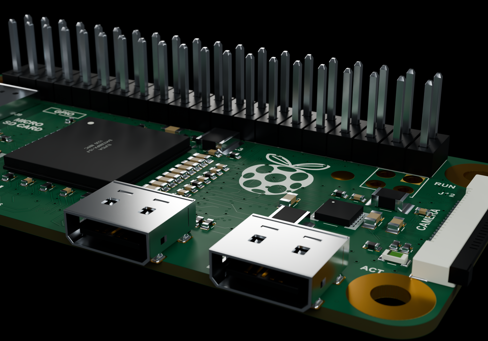
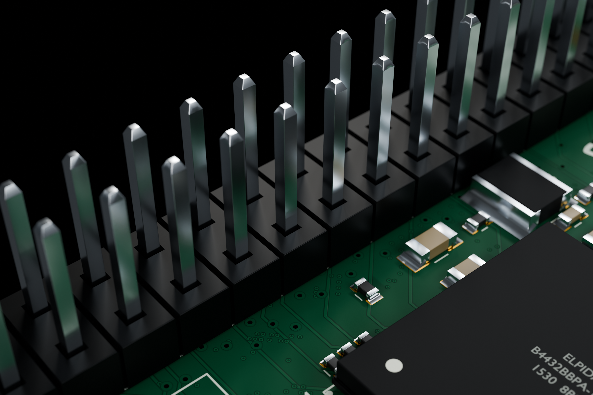
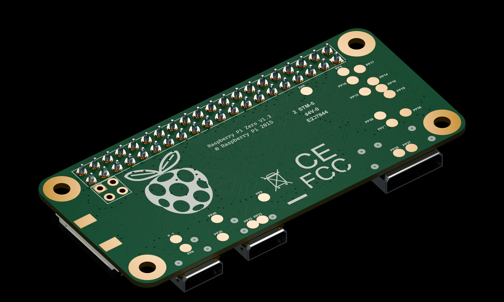

# Raspberry Pi Zero v1.3 — 상세 모델

Geometrick의 [확대 분해 렌더](../SeedSigner/Reference/13_Exploded_Closeup.jpg)를 참고해 기존 Raspberry Pi Zero v1.3 모델을 다시 제작했습니다. 무선 기능이 없는 버전이며, 헤더가 있는 모델과 없는 모델을 함께 제공합니다.

[STEP](Raspberry_Pi_Zero_v1_3_with_GPIO.step) · [재질 포함 GLB](Raspberry_Pi_Zero_v1_3_with_GPIO.glb) · [Blender 원본](Raspberry_Pi_Zero_v1_3_Detail.blend)

헤더 없는 모델: [Bare STEP](Bare/Raspberry_Pi_Zero_v1_3_bare.step) · [Bare GLB](Bare/Raspberry_Pi_Zero_v1_3_bare.glb)

## 이번 재제작에서 추가한 디테일

- Micro USB 2개와 mini HDMI의 절곡 금속 외피, 접점, 유지 스프링, 굽힌 납땜 리드.
- microSD 소켓의 열린 내부, 금속 리브, 스프링 접점과 CSI 소켓의 단자·래치 구조.
- 소형 부품의 감싸는 전극과 곡면 납땜, 사진을 참고한 추가 소형 부품.
- 실제로 뚫린 작은 홀 145개와 도금된 내부·표면 랜드.
- 은색 40핀 GPIO, 양끝 가공, 플라스틱 헤더 홈과 핀 주위 납땜 곡면.
- 6144 × 2836 해상도의 기판 앞·뒷면 인쇄, 표면 요철과 거칠기. 금속에는 미세한 결을 추가했습니다.

기본 모델은 1,562개의 부품 형상, 1,605개의 솔리드를 포함합니다. 이전 모델은 662개의 부품 형상이었습니다.

## 프로그램별 사용

**KeyShot:** 미세한 기판 무늬와 금속 재질까지 함께 시작하려면 GLB를 가져오세요. 앞·뒷면 색상, 거칠기와 노멀맵, 금속 표면 맵이 파일 안에 포함되어 있습니다. STEP은 상세 CAD 형상을 전달하지만 이미지 텍스처와 렌더 조명은 포함하지 않으므로 KeyShot에서 재질을 지정해야 합니다. 별도 맵은 [Textures](Textures/)에 있습니다.

**Blender:** 원본 BLEND에 재질과 이미지가 내장되어 있고 전체·커넥터·GPIO·뒷면 카메라와 조명이 준비되어 있습니다.

STEP 좌표는 mm, GLB와 Blender 내부 좌표는 m입니다. 실제 기판 크기는 세 형식에서 동일합니다.

[KeyShot 지원 형식](https://manuals.keyshot.com/kss2026/en-us/manual/supported-file-formats.html) · [glTF 재질 지원 변경 사항](https://support.keyshot.com/en/knowledge-base/new-features-in-2025.3)

## 치수와 재구성 범위

PCB 외곽 65 × 30 mm, 장착홀 중심 간격 58 × 23 mm, 홀 지름 2.75 mm, GPIO 2 × 20 / 2.54 mm 피치를 유지했습니다.

원작자의 CAD 파일을 복제한 모델이 아닙니다. 제공된 렌더와 Raspberry Pi Zero v1.3 제품 사진을 참고해 형상과 표면을 재구성했습니다. PCB 두께 1.0 mm, 작은 부품 위치·높이, 커넥터 내부·납땜과 회로 표면 무늬는 재구성 값입니다. 회로 무늬는 제조용 배선·드릴 데이터가 아닙니다.

모든 CAD 솔리드의 유효성과 장착홀·GPIO를 검사하고 두 STEP을 다시 열었습니다. 두 GLB와 Blender 원본도 Blender에서 독립적으로 다시 열어 크기·재질·내장 이미지를 확인했습니다. 실제 KeyShot 앱에서의 가져오기 검사는 수행하지 않았습니다. [Verification.json](Verification.json)에 결과와 파일 해시가 있습니다.

## 출처

- [사용자 레퍼런스 / Geometrick](https://x.com/designbtc/status/1512501579630497808)
- [Raspberry Pi Zero](https://www.raspberrypi.com/products/raspberry-pi-zero/)
- [Pi Zero v1.3 기계 도면](https://files.waveshare.com/upload/9/9b/Rpi_MECH_Zero_1p3.pdf)
- [Adafruit Pi Zero v1.3 제품 사진](https://www.adafruit.com/product/2885)
