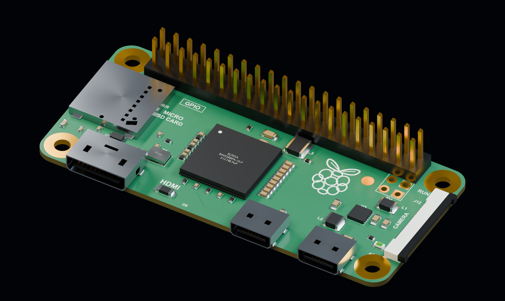

# Raspberry Pi Zero v1.3

무선 기능이 없는 Raspberry Pi Zero v1.3 모델입니다. CSI 커넥터, mini HDMI, micro USB 2개, microSD 소켓과 소형 부품을 분리한 형상입니다. 기본 파일에는 40핀 수 헤더가 포함됩니다.

[STEP 다운로드](Raspberry_Pi_Zero_v1_3_with_GPIO.step) · [GLB 다운로드](Raspberry_Pi_Zero_v1_3_with_GPIO.glb)

헤더 없는 모델: [Bare STEP](Bare/Raspberry_Pi_Zero_v1_3_bare.step) · [Bare GLB](Bare/Raspberry_Pi_Zero_v1_3_bare.glb)

## KeyShot에서 사용하기

- **STEP**: CAD 곡면·솔리드 형상과 기본 부품 색상을 가져올 때 사용합니다. 확대 렌더에서 곡면 품질을 조정하고 KeyShot 재질을 직접 지정하기 좋습니다.
- **GLB**: 메시 형상과 PBR 재질을 함께 가져올 때 사용합니다. 파일 하나로 이미지·재질 리소스를 전달할 수 있습니다.
- STEP 좌표 단위는 **mm**, GLB 좌표 단위는 **m**입니다. GLB의 1 m는 1000 mm에 해당하며 형상의 실제 크기는 두 형식이 같습니다.
- KeyShot Studio 2026은 STEP과 GLB를 지원합니다. glTF 재질에 OpenPBR가 추가된 **2025.3 이상**을 권장합니다. 이전 버전에서는 재질 표현이 달라질 수 있습니다.
- STEP의 이미지 텍스처는 포함되지 않습니다. 가져온 뒤 조명·금속·플라스틱·렌즈 재질을 확인하고 필요에 맞게 조정하십시오.
- 형상, STEP 재열기, GLB 구성과 내장 리소스를 검증했습니다. 실제 KeyShot 앱에서의 가져오기 시험은 수행하지 않았습니다.

[KeyShot 지원 형식](https://manuals.keyshot.com/kss2026/en-us/manual/supported-file-formats.html) · [glTF/OpenPBR 변경 사항](https://support.keyshot.com/en/knowledge-base/new-features-in-2025.3)

## 모델 범위

PCB 외곽 65 × 30 mm, 장착홀 중심 간격 58 × 23 mm, 홀 지름 2.75 mm, GPIO 2 × 20 / 2.54 mm 피치입니다. PCB 두께 1.0 mm와 작은 부품·커넥터 내부·납땜 높이는 재구성 값입니다.

GLB에는 기판 앞·뒷면의 인쇄·배선 무늬와 거칠기 이미지 4장이 내장되어 있습니다. 배선 무늬는 시각 표현이며 제작용 회로 데이터가 아닙니다.

## 참고 자료

- https://www.raspberrypi.com/products/raspberry-pi-zero/
- https://files.waveshare.com/upload/9/9b/Rpi_MECH_Zero_1p3.pdf
- https://www.adafruit.com/product/2885
