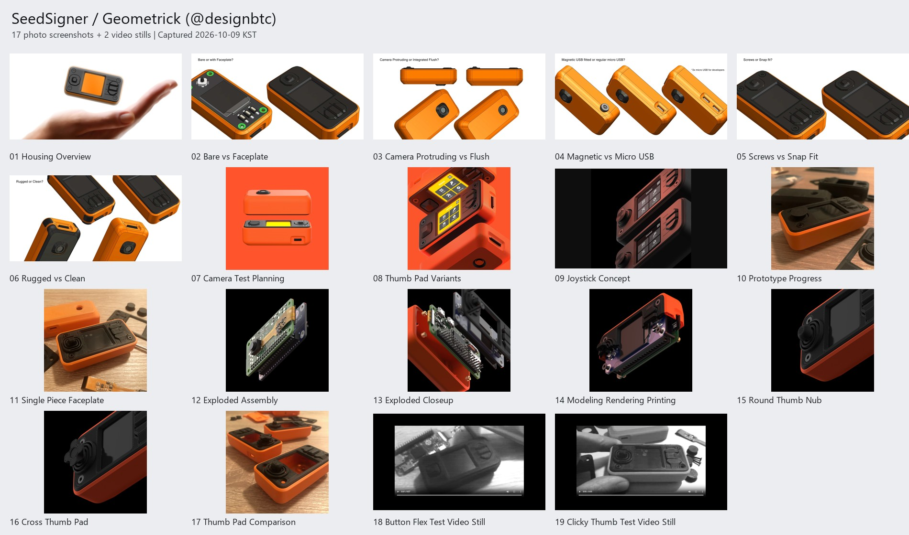

# SeedSigner 레퍼런스

[요청한 포스트](https://x.com/designbtc/status/1493725108761993223)와 연결된 [Geometrick (@designbtc)의 작성자 스레드](https://x.com/designbtc/status/1493725071197802497)에서 공개 첨부 미디어를 캡처했습니다.

사진·렌더 이미지 17장과 영상 장면 2장, 총 19개의 JPG 스크린샷입니다. 스레드 게시 기간은 2022-02-16부터 2022-04-12까지이며, 캡처일은 2026-10-09 한국 시간입니다. 이미지가 없는 투표 5개와 텍스트 게시물 1개는 출처 목록에 기록했습니다.

사진은 브라우저에서 원본 크기로 펼친 뒤 전체 페이지를 캡처했습니다. 작은 이미지에는 브라우저 배경 여백이 포함될 수 있습니다. 영상은 원본 플레이어에서 재생 완료된 장면을 캡처했으며, 동영상 전체 파일은 포함하지 않습니다. JPG는 브라우저가 생성한 스크린샷이므로 원본 미디어 파일과 구분됩니다.

| 번호 | 캡처 | 출처 포스트 | 캡처 크기 |
| --- | --- | --- | --- |
| 01 | [전체 외형](01_Housing_Overview.jpg) | [X](https://x.com/designbtc/status/1493725071197802497) | 2000 × 1000 |
| 02 | [페이스플레이트 유무 비교](02_Bare_vs_Faceplate.jpg) | [X](https://x.com/designbtc/status/1493725075559878659) | 2000 × 1000 |
| 03 | [카메라 돌출·매립 비교](03_Camera_Protruding_vs_Flush.jpg) | [X](https://x.com/designbtc/status/1493725083944247299) | 2000 × 1000 |
| 04 | [자석 USB·Micro USB 비교](04_Magnetic_vs_Micro_USB.jpg) | [X](https://x.com/designbtc/status/1493725092832022533) | 2000 × 1000 |
| 05 | [나사·스냅핏 비교](05_Screws_vs_Snap_Fit.jpg) | [X](https://x.com/designbtc/status/1493725101929467906) | 2000 × 1000 |
| 06 | [러기드·클린 외장 비교](06_Rugged_vs_Clean.jpg) | [X](https://x.com/designbtc/status/1493725108761993223) | 2000 × 1000 |
| 07 | [카메라 배치 테스트 구상](07_Camera_Test_Planning.jpg) | [X](https://x.com/designbtc/status/1494081647561646080) | 1272 × 1272 |
| 08 | [엄지 패드 변형](08_Thumb_Pad_Variants.jpg) | [X](https://x.com/designbtc/status/1494763070560043008) | 1733 × 1733 |
| 09 | [조이스틱 구상](09_Joystick_Concept.jpg) | [X](https://x.com/designbtc/status/1495835152710516736) | 1265 × 735 |
| 10 | [출력 프로토타입](10_Prototype_Progress.jpg) | [X](https://x.com/designbtc/status/1511098579250814978) | 3024 × 3024 |
| 11 | [일체형 페이스플레이트](11_Single_Piece_Faceplate.jpg) | [X](https://x.com/designbtc/status/1511439991053901829) | 3024 × 3024 |
| 12 | [전체 분해도](12_Exploded_Assembly.jpg) | [X](https://x.com/designbtc/status/1512459593217101828) | 1735 × 1735 |
| 13 | [분해도 상세](13_Exploded_Closeup.jpg) | [X](https://x.com/designbtc/status/1512501579630497808) | 1735 × 1735 |
| 14 | [모델링·렌더링·출력 참고](14_Modeling_Rendering_Printing.jpg) | [X](https://x.com/designbtc/status/1513201733727625216) | 1735 × 1735 |
| 15 | [원형 엄지 패드](15_Round_Thumb_Nub.jpg) | [X](https://x.com/designbtc/status/1513635026151346183) | 1735 × 1735 |
| 16 | [십자형 엄지 패드](16_Cross_Thumb_Pad.jpg) | [X](https://x.com/designbtc/status/1513635201473261571) | 1735 × 1735 |
| 17 | [출력된 패드 비교](17_Thumb_Pad_Comparison.jpg) | [X](https://x.com/designbtc/status/1513635555414011904) | 3024 × 3024 |
| 18 | [버튼 유연성 테스트 영상 장면](18_Button_Flex_Test_Video_Still.jpg) | [X](https://x.com/designbtc/status/1496636671584276482) | 1280 × 720 |
| 19 | [엄지 조작부 테스트 영상 장면](19_Clicky_Thumb_Test_Video_Still.jpg) | [X](https://x.com/designbtc/status/1511439983244201990) | 1280 × 720 |

파일별 원본 미디어 URL, 게시일, 캡처 시각, 영상 프레임 시각, 파일 크기와 SHA-256은 [SOURCES.json](SOURCES.json)에 기록했습니다.

원작자 및 출처: [Geometrick / @designbtc](https://x.com/designbtc).
