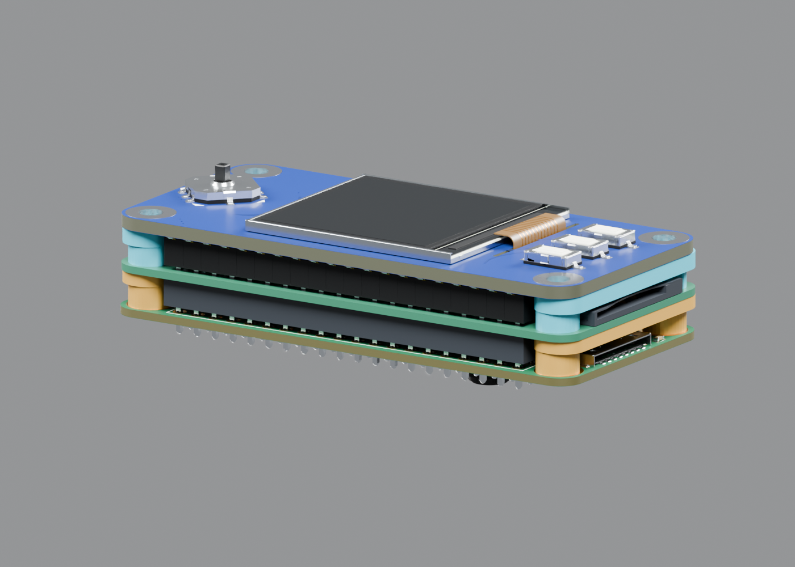
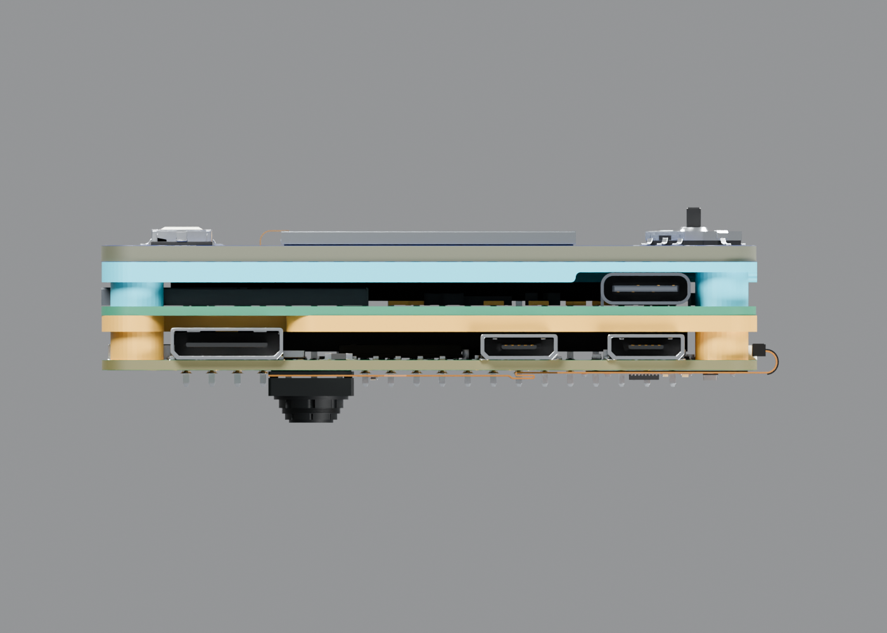

# ShieldSigner Assembly GPIO 11mm

GPIO의 검은 플라스틱 가드를 제거한 **기판 상면 기준11mm 금속40핀**과 밑면 장착 OV5647 카메라를 포함한 조립 모델입니다.

조립 순서: **Pi → 아랫받침 → SmartCard HAT → 윗받침 → LCD HAT**.

두 원본 받침 STEP의 실제 지지면으로 높이를 맞췄습니다. SmartCard는 이전 깊은 배치보다약2.763mm 올라갔으며, 카메라 바닥 여유는약0.283mm입니다. 두 받침의 가로 위치도 나사 축에 맞춰 조정했습니다. 카메라 구멍 중심과 렌즈 축을 맞췄고, 기존59.7mm FPC와 회로·포트·렌즈 디테일을 유지했습니다.

## 파일

- [Blender 조립 원본](ShieldSigner_Support_Contact_Stack_11mm.blend): 전체 조립과 재질·내장 이미지·조명.
- [GLB 조립 모델](ShieldSigner_Support_Contact_Stack_11mm.glb): 전체 조립의 재질과 부품 계층.
- 받침 CAD: [ShieldSigner_Bottom_Support_Positioned.step](ShieldSigner_Bottom_Support_Positioned.step) · [ShieldSigner_Supports_Positioned.step](ShieldSigner_Supports_Positioned.step) · [ShieldSigner_Top_Support_Positioned.step](ShieldSigner_Top_Support_Positioned.step)
- [치수/배치/남은 간섭](Measurements.json) · [재열기/형상 검증](Verification.json) · [파일 해시](SHA256SUMS.txt).

전체 조립 BLEND/GLB 단위는 **m**, 받침 CAD 및 검사 치수는 **mm**입니다. 개별/합본 STEP과 FCStd는 위치가 반영된 **두 받침만** 포함합니다. **전체 조립 STEP은 아닙니다.**

BLEND/GLB는 [Git LFS](https://docs.github.com/en/repositories/working-with-files/managing-large-files/about-git-large-file-storage)로 저장합니다. GitHub 파일 화면의 다운로드 버튼을 사용하거나, Git LFS가 설치된 환경에서 저장소를 클론하세요. 클론 후 포인터만 보이면 `git lfs pull`로 원본을 받으세요. 형상과 재질은 압축·단순화하지 않았습니다.

## 모델 상태

**렌더링·슬라이드 애니메이션 참조 모델이며 전체 실물 조립/제작 검증 완료본은 아닙니다.** 11mm 핀40개와 LCD 기판의 간섭이 남습니다. SmartCard 리더 본체/LCD 소켓, 조이스틱/덮개 및 아랫받침 나사 여유 문제도 남습니다. 원본 받침23.5mm/Pi23.0mm 구멍 간격 차이를 유지했습니다.

미리보기의 금색은 아랫받침, 하늘색은 윗받침 식별용입니다. 제품별 카메라와 Pi는 함께 움직이는 그룹으로 묶였습니다. 이 폴더의 미리보기는 실제11mm 조립 파일에서 생성했습니다.

