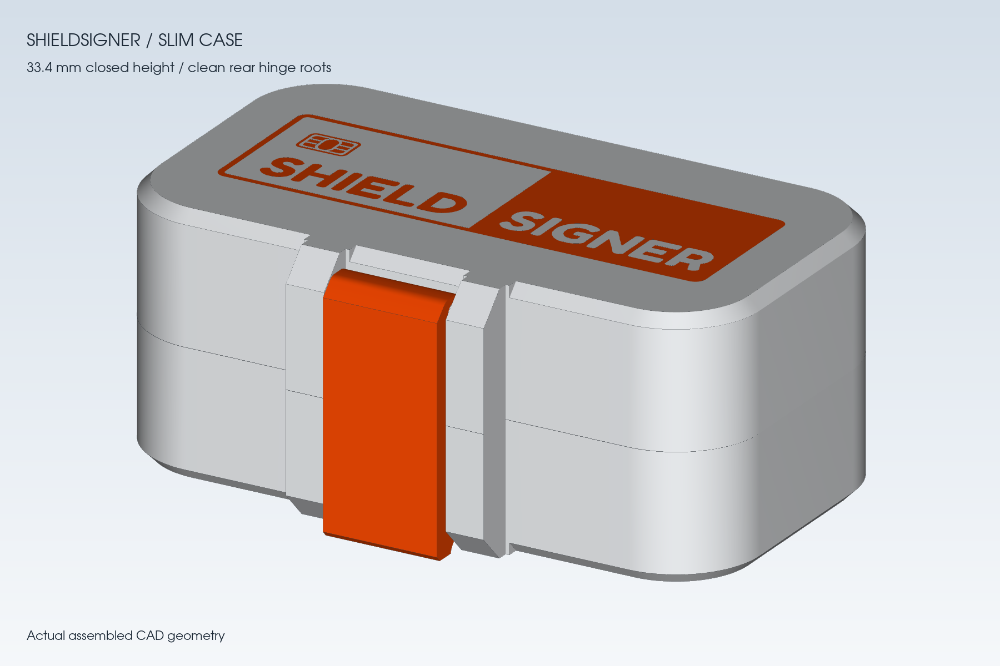
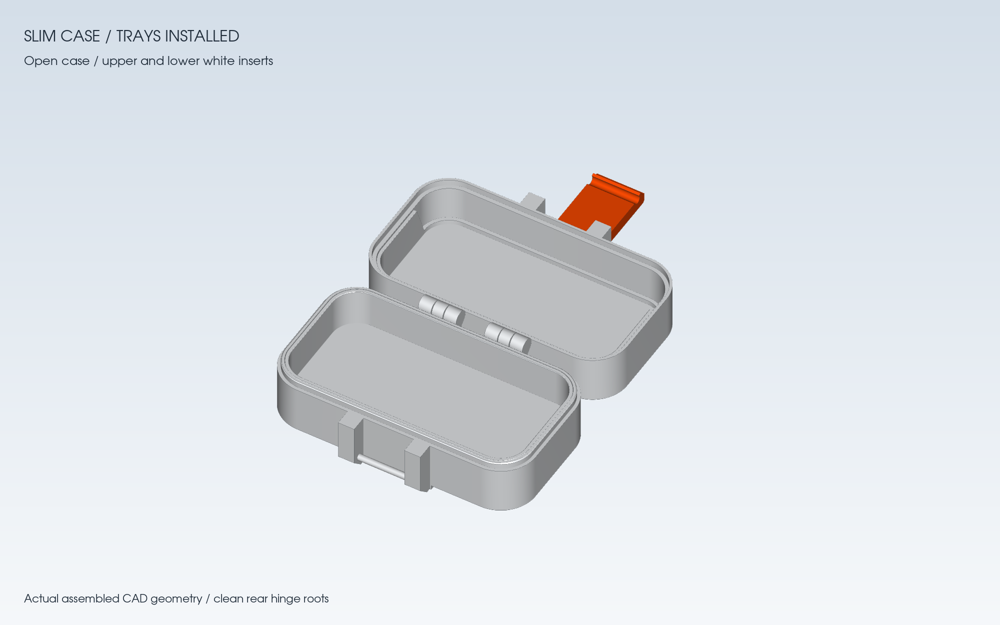

# ShieldSigner Secret Case

ShieldSigner를 위한 스크류리스 케이스와 탈착식 상·하판 트레이입니다. 아랫판 트레이 아래에는 일반 SIM 카드 2개와 microSD 카드 2개를 보관하는 숨겨진 공간이 있습니다.

닫힌 높이를 **35.0 → 33.4 mm**로 줄인 슬림 버전입니다. 상·하판의 바깥면을 각각 0.8 mm씩 깎아 외판 두께는 1.2 mm입니다. 내부 유효 공간 73.9 × 37.0 × 24.8 mm와 카드 보관 공간, 트레이 공차는 유지했습니다. 기존 상·하판 트레이를 그대로 사용할 수 있습니다.

뒤 경첩 아래의 길게 돌출된 받침은 외곽 경사와 이어지는 45° 면으로 정리했습니다. 앞 레버의 자유단도 낮아진 케이스 밑으로 튀어나오지 않도록 줄였습니다. 로고 면과 출력 바닥은 평평합니다.

## 다운로드

| 부품 | STL | STEP |
| --- | --- | --- |
| 케이스 — 본체·뚜껑·레버를 펼친 출력 배치 | [Case_Open.stl](Case_Open.stl) | [Case_Open.step](Case_Open.step) |
| 윗판 트레이 | [Upper_Tray.stl](Upper_Tray.stl) | [Upper_Tray.step](Upper_Tray.step) |
| 아랫판 트레이 — 밀착형 V2 | [Lower_Tray.stl](Lower_Tray.stl) | [Lower_Tray.step](Lower_Tray.step) |

다색 출력에는 **[Case_Open_Color.3mf](Case_Open_Color.3mf)**를 사용하세요. 한 조립체 안에 본체·상판·ShieldSigner 로고·레버가 각각 별도 파트로 들어 있습니다. 글자·테두리·SIM 문양을 한 로고 파트로 묶어 색상을 한 번에 지정할 수 있습니다.

| 파트 이름 | 권장 색상 | 지정할 필라멘트 번호 |
| --- | --- | --- |
| `Base_White` | 흰색 | 1 |
| `Lid_White` | 흰색 | 1 |
| `ShieldSigner_Logo_Orange` | 주황색 | 2 |
| `Clip_Orange` | 주황색 | 2 |

`Case_Open.stl`도 로고를 합치지 않은 4개 이름 있는 구간으로 변경했습니다. STL 자체에는 필라멘트 색상 정보를 저장할 수 없으며, 슬라이서에 따라 파트 이름을 무시하거나 접촉면을 합칠 수 있습니다. 파트 구분을 유지하려면 3MF를 사용하세요. 두 트레이의 STL·STEP은 기존 파일과 동일합니다.

Bambu Studio에서는 3MF를 불러온 뒤 흰색·주황색 필라멘트를 추가하고, **객체(Objects)** 목록에서 위 표대로 파트별 필라멘트를 지정하세요. 프린터와 실제 재료는 사용할 프로필로 선택하고, 슬라이싱 후 첫 레이어의 로고를 확인하세요. 파일에는 특정 프린터 프로필을 넣지 않았습니다. AMS의 실제 슬롯도 선택한 필라멘트에 맞춰 연결해야 합니다.

## 출력과 설치

- 케이스는 열린 상태로 출력합니다. 스크류리스 경첩과 앞 레버의 상대 위치를 유지하세요. 부품별 자동 배치로 위치를 바꾸지 마세요.
- 두 트레이는 평평한 바닥을 빌드 플레이트에 놓고, 빈 공간이 위를 향하도록 출력합니다.
- 윗판 트레이의 **낮은 벽이 앞 레버 쪽**, 높은 벽이 경첩 쪽을 향하도록 끼우세요. 옆벽 경사는 뚜껑을 닫을 때 기기를 스치지 않도록 만든 형상입니다.
- 아랫판 트레이를 끝까지 눌러 끼우면 본체 안쪽 테두리와 높이가 맞습니다. 카드를 꺼낼 때는 기기를 먼저 빼고 트레이 경계에서 얇은 플라스틱 헤라로 조금씩 들어 올립니다.
- 전체 트레이를 다시 출력할 필요가 없는 경우 필요한 트레이 파일만 출력하면 됩니다.
- 로고는 상판 바깥면의 첫 0.20 mm 레이어에 들어가는 평평한 형상입니다.
- 다색 로고를 한 층으로 출력하려면 첫 레이어 높이를 **0.20 mm**로 유지하세요. 로고 파트를 별도 객체로 분리하거나 자동 배치하지 마세요.

## 기준 치수

| 항목 | 치수 |
| --- | --- |
| ShieldSigner 기기 | 72.6 × 35.7 × 24.3 mm |
| 트레이 안쪽 가로·세로 | 73.9 × 37.0 mm |
| 두 트레이 설치 후 유효 높이 | 24.8 mm |
| 기기 위쪽 여유 | 0.5 mm |
| 아랫판 / 윗판 트레이 바닥 두께 | 1.2 / 0.8 mm |
| 트레이와 케이스의 기본 공차 | 한쪽당 0.06 mm |
| 마찰 리브 돌출 / 국부 압입량 | 0.24 / 0.18 mm |
| 상·하판 외판 두께 | 1.2 mm |
| 상·하판 외곽 경사면 | 새 바닥 기준 1.5 mm, 45° — 앞 레버 연결부 제외 |
| SIM 보관 규격 | 일반 SIM 25 × 15 mm, 2개 |
| microSD 보관 규격 | 15 × 11 mm, 2개 |
| 닫힌 케이스 전체 외곽, 경첩·레버 포함 | 약 80.2 × 54.92 × 33.4 mm |

## 검증 범위

- 아랫판 V2 트레이의 끼움과 기기 수납은 실물 출력으로 확인했습니다.
- 윗판 트레이의 회전 간섭은 이전 버전에서 0~180도, 1도 간격으로 검사했습니다. 검사한 자세에서 기기와의 최소 거리는 약 0.365 mm였습니다. 이번 수정에서는 트레이와 기기·경첩의 상대 위치를 유지했습니다.
- 슬림 버전의 닫힌 CAD 높이 33.4 mm와 기기와 케이스·트레이 사이의 체적 겹침이 없음을 확인했습니다. 외판과 레버 끝단을 제거하고 평평한 로고를 새 첫 층으로 옮긴 수정입니다.
- STL·3MF의 4개 색상 파트는 각각 닫힌 메쉬입니다. 케이스 STEP과 다색 파트의 합집합도 일치합니다.
- 슬림 케이스와 윗판 트레이의 실물 출력·끼움·개폐 시험은 아직 하지 않았습니다. 출력 재료와 치수 보정에 따라 끼움 정도가 달라질 수 있습니다.

## 형상 참고

케이스 구조는 제공받은 `rugged_box_40x40_with_hindge.stl`을 바탕으로 수정했습니다. STEP은 원본 STL에서 변환한 솔리드와 추가 CAD 형상을 포함하며, 완전한 파라메트릭 설계 이력은 포함하지 않습니다.
