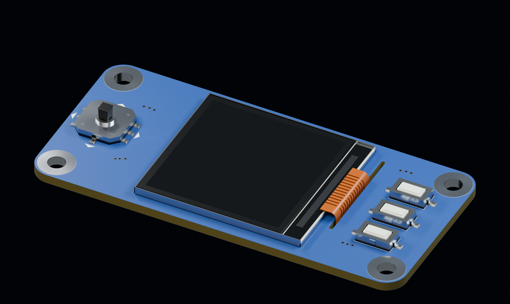

# Waveshare 1.3inch LCD HAT

240 × 240 LCD, 조이스틱과 버튼 3개가 있는 원본 Waveshare 1.3inch LCD HAT입니다. LCD 적층, 금속 프레임, 플렉스, 스위치, 뒷면 40핀 소켓을 분리했습니다.

[STEP 다운로드](Waveshare_LCD_HAT_1_3.step) · [GLB 다운로드](Waveshare_LCD_HAT_1_3.glb)

## KeyShot에서 사용하기

- **STEP**: CAD 곡면·솔리드 형상과 기본 부품 색상을 가져올 때 사용합니다. 확대 렌더에서 곡면 품질을 조정하고 KeyShot 재질을 직접 지정하기 좋습니다.
- **GLB**: 메시 형상과 PBR 재질을 함께 가져올 때 사용합니다. 파일 하나로 이미지·재질 리소스를 전달할 수 있습니다.
- STEP 좌표 단위는 **mm**, GLB 좌표 단위는 **m**입니다. GLB의 1 m는 1000 mm에 해당하며 형상의 실제 크기는 두 형식이 같습니다.
- KeyShot Studio 2026은 STEP과 GLB를 지원합니다. glTF 재질에 OpenPBR가 추가된 **2025.3 이상**을 권장합니다. 이전 버전에서는 재질 표현이 달라질 수 있습니다.
- STEP의 이미지 텍스처는 포함되지 않습니다. 가져온 뒤 조명·금속·플라스틱·렌즈 재질을 확인하고 필요에 맞게 조정하십시오.
- 형상, STEP 재열기, GLB 구성과 내장 리소스를 검증했습니다. 실제 KeyShot 앱에서의 가져오기 시험은 수행하지 않았습니다.

[KeyShot 지원 형식](https://manuals.keyshot.com/kss2026/en-us/manual/supported-file-formats.html) · [glTF/OpenPBR 변경 사항](https://support.keyshot.com/en/knowledge-base/new-features-in-2025.3)

## 모델 범위

PCB 외곽 65 × 30.2 mm, 장착홀 중심 간격 58 × 23.2 mm, 홀 지름 3 mm입니다. PCB 두께 1.6 mm, LCD 적층 및 조이스틱·버튼·헤더 높이는 사진과 관련 패널 자료를 참고한 재구성 값입니다.

GLB에는 기판 앞·뒷면의 인쇄·배선 무늬와 거칠기 이미지 4장이 내장되어 있습니다. 화면은 꺼진 상태이며 배선 무늬는 제작용 회로 데이터가 아닙니다.

## 참고 자료

- https://www.waveshare.com/wiki/1.3inch_LCD_HAT
- https://www.waveshare.com/img/devkit/LCD/1.3inch-LCD-HAT/1.3inch-LCD-HAT-size.jpg
- https://files.waveshare.com/upload/a/a6/1.3inch-LCD-HAT-Schematic.pdf
