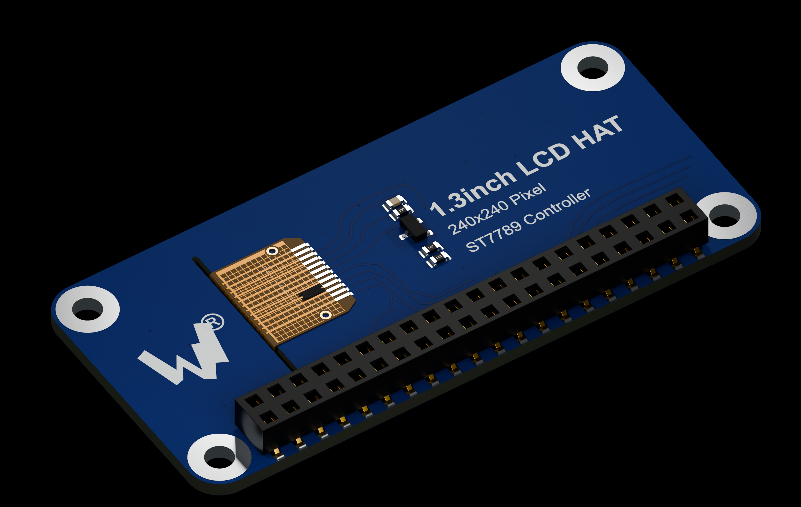
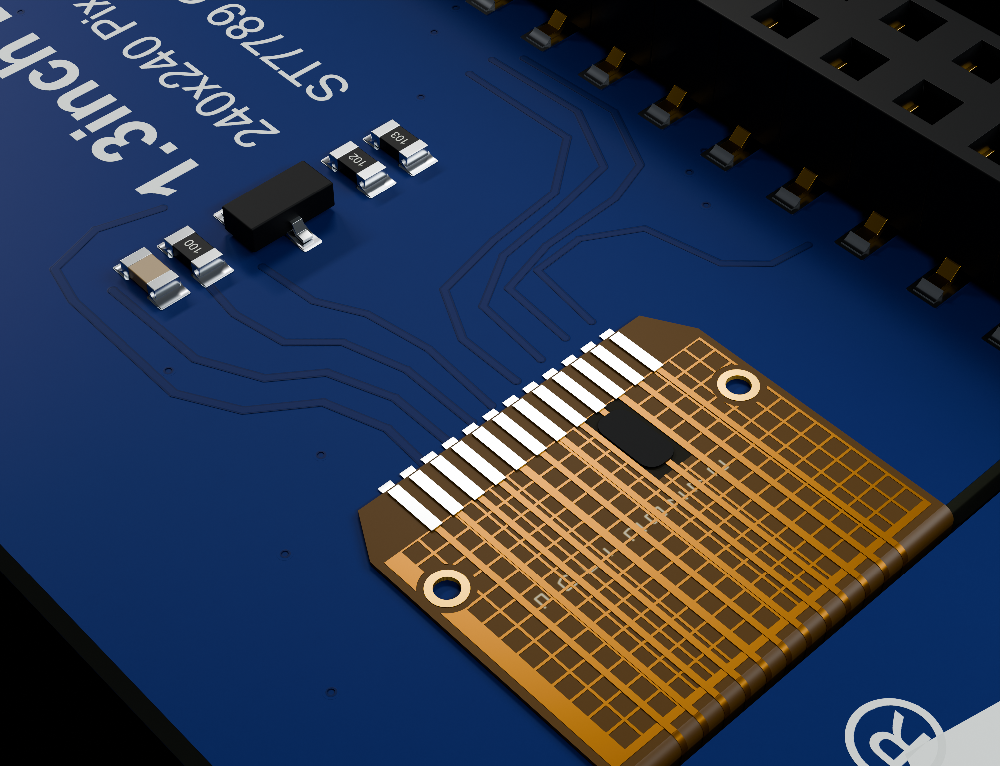
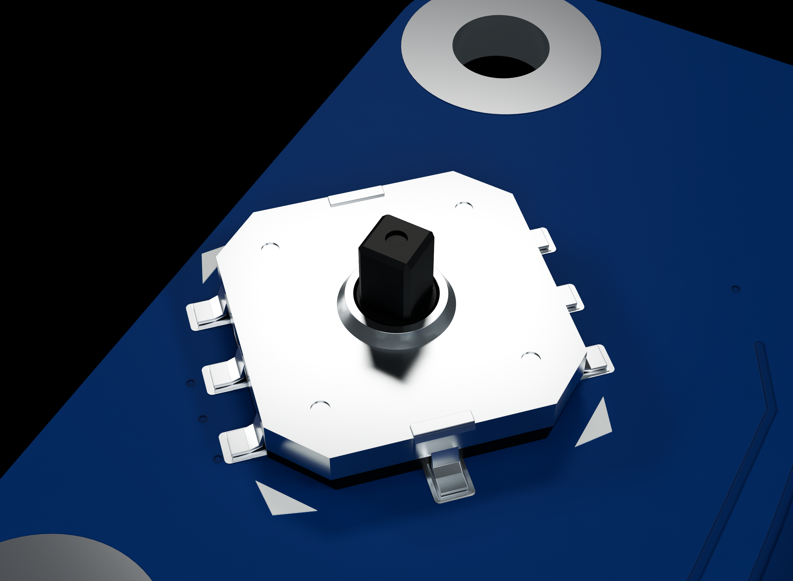
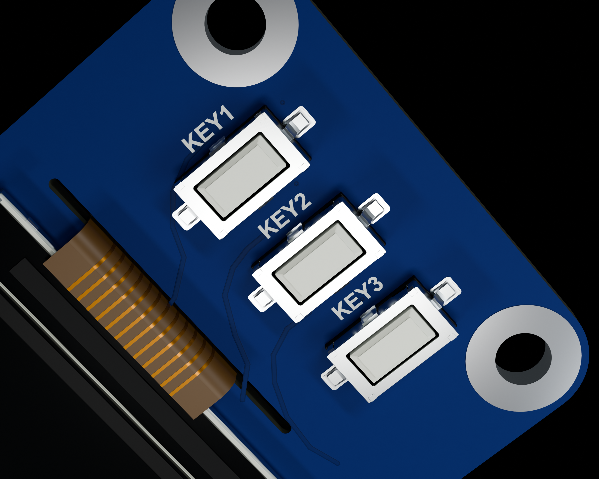
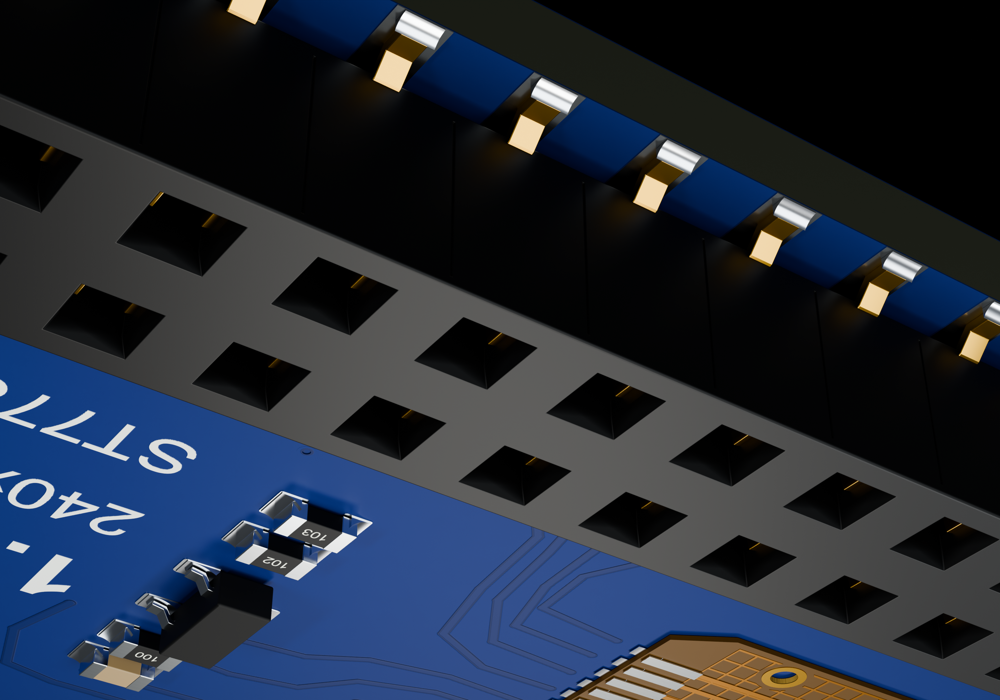

# Waveshare 1.3inch LCD HAT — 상세 모델

원본 파란색 240 × 240 LCD HAT를 제품 앞·뒷면 사진과 공식 회로도 기준으로 다시 만들었습니다. 조이스틱, 버튼 3개, LCD 적층과 필름 배선, 뒷면 부품 및 40핀 암 소켓을 개별 형상으로 분리했습니다.

[STEP](Waveshare_LCD_HAT_1_3.step) · [재질 포함 GLB](Waveshare_LCD_HAT_1_3.glb) · [Blender 원본](Waveshare_LCD_HAT_1_3_Detail.blend)

## 사진을 기준으로 보강한 부분

- 뒷면 저항 3개, 커패시터 C1, S8050 트랜지스터 Q1의 배치, 감싸는 전극과 곡면 납땜.
- LCD의 얇은 금속 트레이, 접힌 가장자리, 검은 유리와 편광층, 슬롯을 통과하는 필름 배선 및 12개 접점.
- 조이스틱의 성형 금속 덮개, 중앙 축과 단자, 세 버튼의 금속 절곡·플라스틱 누름부.
- FH-00339 규격의 낮은 40핀 암 소켓, 열린 입구와 개별 스프링 접점, 굽힌 SMT 리드 및 납땜.
- 사진을 참고한 배선 곡선, 비아처럼 보이는 표면점과 얕은 솔더마스크 개구, 기판 앞·뒷면 인쇄. CAD 표면 형상과 색상·거칠기·노멀맵을 함께 제공합니다.

모델은 570개의 CAD 부품 형상을 포함합니다. 배선 무늬를 맞추기 위해 CAD와 재질이 같은 위치 자료를 사용합니다.

## KeyShot·CAD·Blender에서 사용

**KeyShot:** 기판 무늬와 재질을 함께 시작하려면 GLB를 가져오세요. 앞·뒷면 PBR 이미지와 금속 표면 맵이 내장되어 있습니다. STEP은 CAD 솔리드와 기본 색상을 전달하지만 이미지 텍스처와 조명은 포함하지 않습니다. 별도 [Textures](Textures/)도 제공합니다. [KeyShot 지원 형식](https://manuals.keyshot.com/kss2026/en-us/manual/supported-file-formats.html)에 STEP과 GLB가 안내되어 있습니다.

**CAD:** STEP 단위는 mm입니다. 부품별 형상을 선택해 재질 지정이나 조립에 사용할 수 있습니다.

앞면에서 조이스틱이 왼쪽, KEY1이 위인 기준으로 뒷면 소켓은 −Y 가장자리에 있습니다. 이 저장소의 Pi Zero 모델과 원점을 맞춰 조립할 때는 Pi를 Z축으로 180° 회전하면 두 GPIO 배열의 방향이 맞습니다.

**Blender:** 원본 BLEND에는 이미지·재질과 6개 검사 장면의 카메라·조명이 포함되어 있습니다. Blender와 GLB 좌표 단위는 m이며, STEP과 실제 크기가 같습니다.

## 치수와 정확도

공식 치수인 PCB 65 × 30.2 mm, 장착홀 중심 간격 58 × 23.2 mm, 홀 지름 3 mm와 LCD 표시 영역 23.4 × 23.4 mm를 유지했습니다. GPIO는 2 × 20개, 2.54 mm 피치입니다.

원작자의 CAD나 제조사의 PCB 제작 파일을 복제한 모델이 아닙니다. 실제 제품 사진과 회로도로 보이는 형상·부품 종류·표면 배선을 재구성했습니다. 기판 두께 1.6 mm, 부품 높이와 패키지·커넥터 내부 구조는 추정값입니다. 배선 무늬는 사진에 보이는 구간을 재구성한 시각 표현이며 제조용 Gerber나 전기적으로 검증된 라우팅 데이터가 아닙니다.

암 소켓은 사용자가 지정한 교체 부품인 Liansheng **FH-00339** 도면의 2 × 20핀 SMT 규격을 적용했습니다. 원래 Waveshare BOM의 소켓 부품 번호는 확인되지 않았습니다. 플라스틱 본체는 **51.2 × 5.0 × 3.5 mm**, 기판 위 장착 높이는 **3.9 mm**이며 본체와 기판 사이의 **0.4 mm 간격**을 반영했습니다. SMT 리드 전체 폭은 6.6 mm, 핀 피치는 2.54 mm입니다. 도면에 표시된 `W=With Post` 위치결정 돌기는 생략한 버전입니다. 기존 기판에는 위치결정용 두 홀을 추가하지 않았습니다. 소켓 내부 스프링의 상세 곡면은 도면 단면을 참고한 시각 재구성입니다.

소켓 중심은 기존 제품 사진의 위치를 유지했습니다. 아래쪽 납땜 패드는 기판 가장자리 안에 들어가도록 끝을 맞췄습니다. 소켓을 제외한 329개 부품의 CAD 형상과 기존 회로 재질은 유지했습니다.

FPC 접점의 0.70 mm 피치는 사진에 맞춘 시각적 추정값입니다. 은색 패드와 접점은 사진의 표면색을 재현한 것이며 실제 도금 공정을 확인한 것은 아닙니다.

모든 CAD 솔리드, 장착홀과 GPIO 배열을 검사하고 STEP을 다시 열었습니다. GLB와 Blender도 별도로 다시 열어 크기·재질·내장 이미지를 확인하고 GLB 소켓 40개의 입구가 막히지 않았는지 검사했습니다. 실제 KeyShot 앱에서의 가져오기 시험은 수행하지 않았습니다. 결과와 파일 해시는 [Verification.json](Verification.json)에 있습니다.

## 참고 자료

- [Waveshare 공식 제품 및 사진](https://www.waveshare.com/product/raspberry-pi/displays/1.3inch-lcd-hat.htm)
- [Waveshare 공식 사양](https://www.waveshare.com/wiki/1.3inch_LCD_HAT)
- [공식 기계 치수](https://www.waveshare.com/img/devkit/LCD/1.3inch-LCD-HAT/1.3inch-LCD-HAT-size.jpg)
- [공식 회로도](https://files.waveshare.com/upload/a/a6/1.3inch-LCD-HAT-Schematic.pdf)
- [FH-00339 제조사 도면](https://datasheet.lcsc.com/datasheet/pdf/f6b712306ee238d037f0521f733ec84a.pdf?productCode=C2685112)
- [제품 앞·뒷면 사진](https://www.welectron.com/Waveshare-14972-13inch-LCD-HAT)
- [Geometrick 렌더 참고](../SeedSigner/Reference/)
